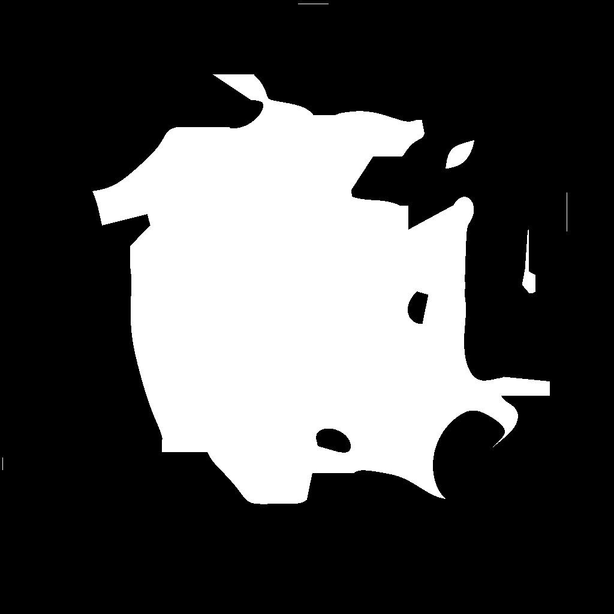
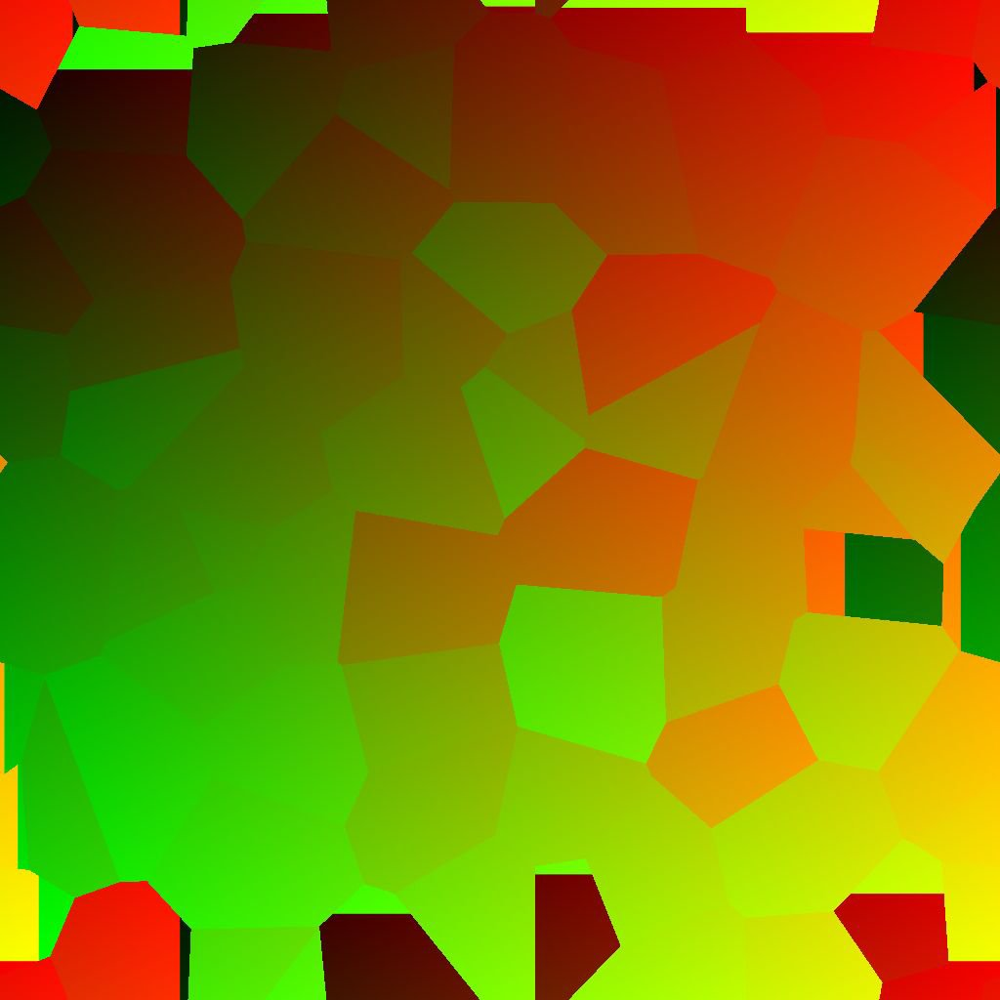

# Diffusion UV

<table>
<tr style="border: 0;">
<td width="33.33%" style="border: 0;" valign="top">

{width="200px"}

<b>In:</b> Filters &gt; Effects

</td>
<td width="100.00%" style="border: 0;" valign="top">

## Description

Apply a diffusion process to the UV coordinates in **Source** image input according to the provided **Mask** image input, interpolating coordinates between values from **Source**.

Only UVs from pixels matching the mask are diffused; other pixels do not participate in the result.

Please note tiling is handled in a special way: When tiling is *enabled* (which is the case by default) neighboring coordinates can be averaged accross the 0/1 limit.

For instance, if the U coordinate value is 0.1 on one pixel and 0.8 on another, the averaged value will be 0.95 rather than 0.45 because *tiling of the coordinates is assumed*. This is independent from the actual pixel position: coordinate values are handled the same way all over the image.

This can lead to undesirable results when using this filter for *texture deformation*. If that happens, make sure your mask defines 'control curves/points' no more than *half a texture length apart*.

</td>
</tr>
</table>

## Inputs

|  |  |
|:---|:---|
| <b>Source</b> <i>Color</i> | The UVs to diffuse. Please note tiling is handled in a special way in this filter (see <i>Description</i>). |
| <b>Mask</b> <i>Grayscale</i> | The diffusion mask: White pixels are sampled in <i>Source</i> and diffused in black pixels. The image should be black and white. If the mask includes gradients, the cutoff value is 0.5. |

## Parameters

|  |  |
|:---|:---|
| <b>Iterations</b> <i>0.0 - 64.0</i> | The number of diffusion iterations to perform (higher is better but slower). Useful values are in the &#91;8, 48&#93; range. Please note that if you are not looking for mathematical correctness, low values are fine or even better. |

## Examples

<table style="margin-top: 32px; margin-bottom: 32px">
    <tr style="border: 0">
        <td style="border: 0; background: transparent">
            
        </td>
        <td style="border: 0; background: transparent">
            
        </td>
    </tr>
    <tr style="border: 0">
        <td style="border: 0; background: transparent">
            
        </td>
        <td style="border: 0; background: transparent">
            
        </td>
    </tr>
</table>
