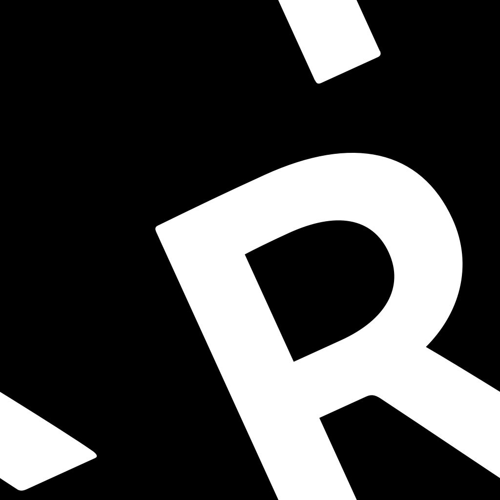
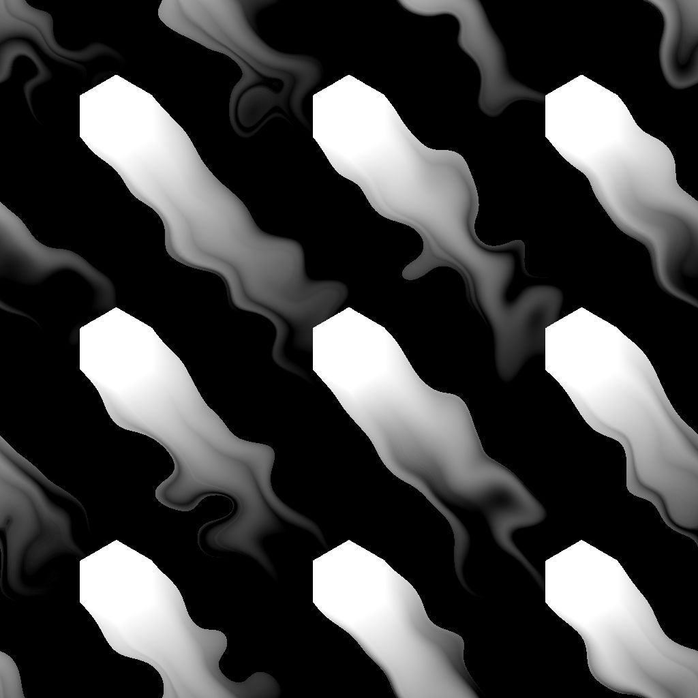

# Directional distance

<table>
<tr style="border: 0;">
<td width="33.33%" style="border: 0;" valign="top">

{width="200px"}

<b>In:</b> Filters &gt; Effects

</td>
<td width="100.00%" style="border: 0;" valign="top">

## Description

Draws a distance gradient from the borders of a mask in a specified direction.

Overlapping gradients are sorted by inverted normalized distance so that the distance to the closest border is drawn.

The distance of the gradient can be dynamically adjusted along the border using a distance map.

</td>
</tr>
</table>

>[!TIP]
>
> The [Bevel smooth](../bevel-smooth/bevel-smooth.md) node offers similar capabilities, where the dilation is performed in all directions.

<table>
<tr style="border: 0;">
<td style="border: 0;" valign="top">

</td>
<td style="border: 0;" valign="top">

</td>
<td style="border: 0;" valign="top">

</td>
</tr>
</table>

## Input connectors

|  |  |
| --- | --- |
| <b>Input</b> *Grayscale* PRIMARY | The image from which the mask should be extracted.   All values above 0.5 are white in that mask. |
| <b>Distance map</b> *Grayscale* | An optional input used when the value of the 'Distance Map Multiplier' parameter is higher than 0.   It is used to adjust the beveling/dilation distance along the borders of the mask, where a darker value results in a shorter distance. |
| <b>Angle map</b> *Grayscale* | An optional input used when the value of the 'Angle Map Multiplier' parameter is higher than 0.   It is used to adjust the direction of the distance gradient by adding its value to the direction angle, in number of turns.   The 'Angle Map Offset' parameter lets you remap the values by specifying which value is 0. |

## Output connectors

|  |  |
| --- | --- |
| <b>Output</b> *Grayscale* | The result image according to the selected 'Output Mode'. |
| <b>UV</b> *Color* | A UV map where the UVs are dilated from the mask borders along the specified direction.   This can be connected to a [UV Mapper](../../../spline-paths-tools/spline-tools/uv-mapper-color/uv-mapper-color.md) node to map any other image using these dilated UVs. |

## Parameters

|  |  |
| --- | --- |
| <b>Output mode</b> *Integer* | The method of drawing the distance gradient from the mask borders:<ul data-preserve-html="true"> <li data-preserve-html="true"><b>Inverted Normalized Distance:</b> A gradient from 1 to 0 where 0 is reached at the 'Maximum Distance', multiplied by the 'Distance Map' if connected</li> <li data-preserve-html="true"><b>Distance:</b> A gradient of raw distance values from the mask border, where 1 is the length of the shorter side of the input image</li> </ul> |
| <b>Maximum distance</b> *Float* | The distance travelled by the distance gradient, in normalized image space where 1 is the length of the shorter side of the input image. |
| <b>Angle</b> *Float* | The direction of the distance gradient in number of turns, where 0 is horizontal and to the right – I.e., a (1,0) vector. |
| <b>Distance map multiplier</b> *Float* | Adjusts the impact of the 'Distance Map' over the 'Maximum Distance'.   Note: This parameter has no effect when the 'Distance Map' input is not connected. |
| <b>Angle map multiplier</b> *Float* | Adjusts the impact of the 'Angle Map' over the 'Angle'. |
| <b>Angle map offset</b> *Float* | Remaps the values in the 'Angle Map' by specifying which value in that map should be 0.   E.g., an offset of 0.5 means that a value of 0.75 is 0.25 turns, and a value of 0.3 is -0.2 turns. |

## Examples

<table>
<tr style="border: 0;">
<td style="border: 0;" valign="top">

<table>
  <tr>
    <td>
      
       <i>Before</i>
    </td>
    <td>
      
       <i>After</i>
    </td>
  </tr>
</table>

</td>
<td style="border: 0;" valign="top">

<table>
  <tr>
    <td>
      
       <i>Before</i>
    </td>
    <td>
      
       <i>After</i>
    </td>
  </tr>
</table>

</td>
</tr>
</table>

<table>
<tr style="border: 0;">
<td style="border: 0;" valign="top">

<table>
  <tr>
    <td>
      
       <i>Before</i>
    </td>
    <td>
      
       <i>After</i>
    </td>
  </tr>
</table>

</td>
<td style="border: 0;" valign="top">

<table>
  <tr>
    <td>
      
       <i>Before</i>
    </td>
    <td>
      
       <i>After</i>
    </td>
  </tr>
</table>

</td>
</tr>
</table>

<table>
  <tr>
    <td>
      
       <i>Before</i>
    </td>
    <td>
      
       <i>After</i>
    </td>
  </tr>
</table>

 