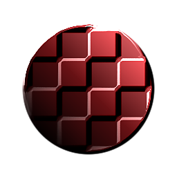

# Emboss With Gloss

<table>
<tr style="border: 0;">
<td style="border: 0;" valign="top">

{width="128px"}

## Emboss With Gloss

**In:** *Filters/Effects*

**Intermediate**

</td>
<td style="border: 0;" valign="top">

## Description

Performs an Embossing effect with added gloss (specular reflection) on a color and height input. Essentially adds fake, baked lighting to an image based on height information. Useful for some texturing styles that require lighting baked into the textures.

For a version with more options, see [Uber Emboss](../uber-emboss/uber-emboss.md). There's also the simpler, atomic version of [Emboss](../../../../atomic-nodes/emboss/emboss.md).

## Parameters

### Inputs

* **Color**: *Color Input*
* **Height**: *Grayscale Input*

### Parameters

* **Highlight Color**: *(Color value)*Color of the specular highlight.
* **Shadow Color**: *(Color value)*Color used in shadowed/unlit areas.
* **Gloss**: *0.0 - 0.5*Glossiness highlight size.
* **Intensity**: *0.0 - 10.0*Intensity of the highlight.
* **Light Angle**: *0.0 - 1.0*  
  Incidence angle of the (faked) light.

## Example Images

|  |
| --- |
| There are no images attached to this page. |

</td>
</tr>
</table>

 