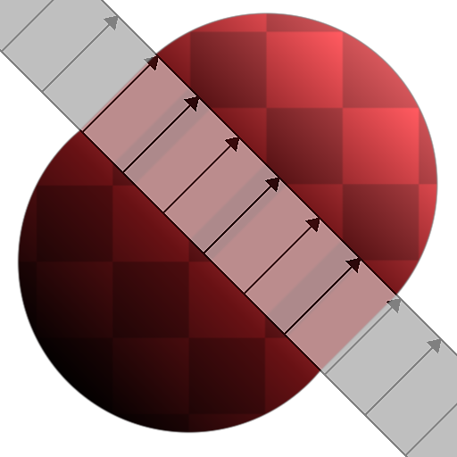

# Extend Shape

<table>
<tr style="border: 0;">
<td width="41.60%" style="border: 0;" valign="top">

<table>
<tr style="border: 0;">
<td style="border: 0;" valign="top">

{width="200px"}

</td>
<td style="border: 0;" valign="top">

{width="200px"}

</td>
</tr>
</table>

**In:** Filters*/Effects*

**Simple**

</td>
<td width="58.30%" style="border: 0;" valign="top">

## Description

The **Extend Shape** node extends a *section* of the **Input** over a set direction and distance.

The **Show helper** parameter lets you visualize the extended section and extension direction.

</td>
</tr>
</table>

## Parameters

* **Mode** *Integer*Defines the *parameters* used to apply the extension:  
  * *Bidirectional*: The section of the **Input** specified by the **Extension Position** and **Extension Angle** is extended over the **Extension Distance** in *opposite directions*  
  * *Unidirectional*: The section of the **Input** specified by the **Extension Position** and **Extension Angle** is extended over the **Extension Distance** in a *single direction*  
  * *Start / End Positions*: An extension *vector* is defined by **Start Position** and **End Position**. The *perpendicular* section of the **Input** at the **Start Position** is extended *over this vector* up to the **End Position**
* **Extension Distance** *Float*The distance over which section specified by the **Extension Position** and **Extension Angle** should be extended. The distance is expressed as a *proportion* of the image span.
* **Extension Position** *Float*The position in the image of the section which should be extended. The value is expressed as an *offset from center*.
* **Extension Angle** *Float*The angle of the section which should be extended, considering the starting point is a *vertical section*.
* **Start Position** *Float2*The start position of the *extension vector*.
* **End Position** *Float2*The end position of the *extension vector*.
* **Start Luminance Offset** *Float*Applies a luminance offset to the area of the image *preceding* the extended section. This luminance offset is *interpolated along the section* to the luminance of the area of the image following the section.  
  *Note*: This parameter is only available in the **Grayscale** version of the node.
* **End Luminance Offset** *Float*Applies a luminance offset to the area of the image *following* the extended section. This luminance offset is *interpolated along the section* to the luminance of the area of the image preceding the section.  
  *Note*: This parameter is only available in the **Grayscale** version of the node.
* **Lum. Offset Ignores Black Pixels** *Boolean*When set to *True*, the luminance offsets specified in *both* **Start Luminance Offset** and **End Luminance Offset** are only applied to *non-black* pixels – i.e., pixels which value is higher than 0.  
  *Note*: This parameter is only available in the **Grayscale** version of the node.
* **Filtering Mode** *Integer*Defines how to treat the sampled results when *interpolating* between pixels:  
  * *Nearest*: will sample exactly the *same* value (faster)  
  * *Bilinear*: will apply a bilinear filter on the result for a *smoother* look
* **Show Helper** *Boolean*Visualize the *extended section* as an overlay with arrows showing the *direction* of the extension.

## Example Images

<table>
<tr style="border: 0;">
<td style="border: 0;" valign="top">

{width="512px"}

</td>
<td style="border: 0;" valign="top">

{width="256px"}

</td>
<td style="border: 0;" valign="top">

{width="256px"}

</td>
<td style="border: 0;" valign="top">

{width="360px"}

</td>
</tr>
</table>
