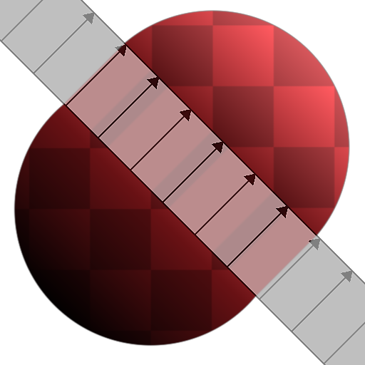
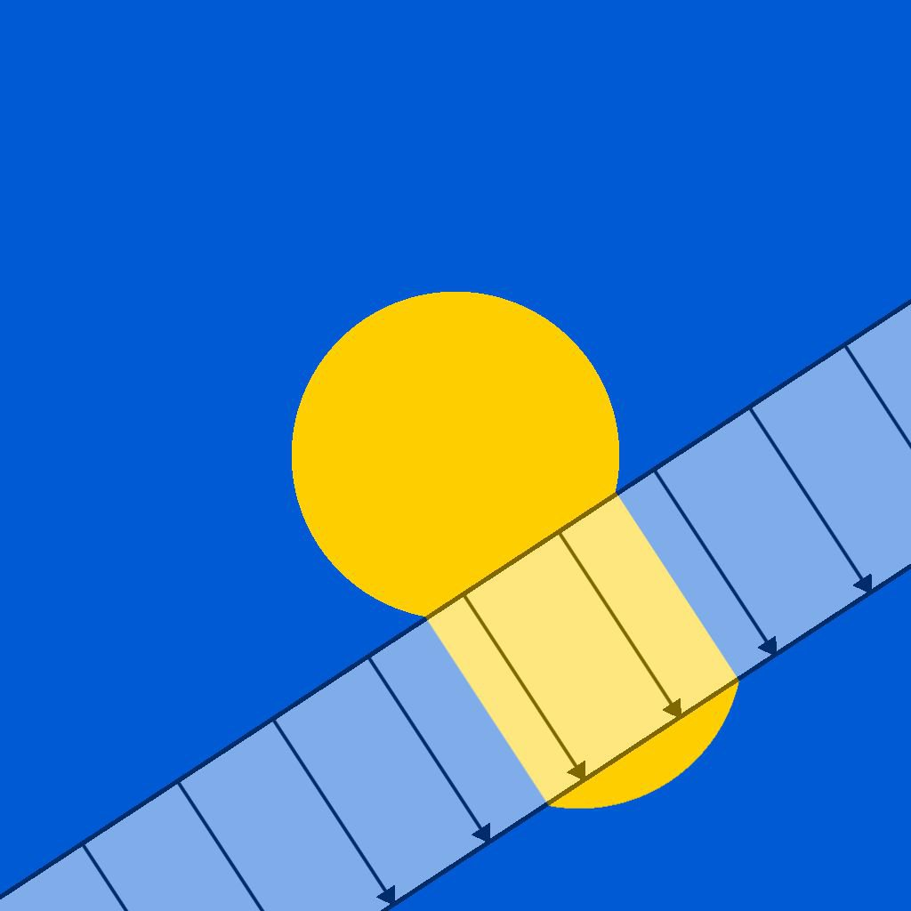

# Extend Shape

<table>
<tr style="border: 0;">
<td width="33.33%" style="border: 0;" valign="top">

<table>
<tr style="border: 0;">
<td style="border: 0;" valign="top">

{width="200px"}

</td>
<td style="border: 0;" valign="top">

{width="200px"}

</td>
</tr>
</table>

<b>In:</b> Filters &gt; Effects

</td>
<td width="100.00%" style="border: 0;" valign="top">

## Description

The <b>Extend Shape</b> node extends a <i>section</i> of the <b>Input</b> over a set direction and distance.

The <b>Show helper</b> parameter lets you visualize the extended section and extension direction.

</td>
</tr>
</table>

## Parameters

|  |  |
|:---|:---|
| <b>Mode</b> <i>Integer</i> | Defines the <i>parameters</i> used to apply the extension:  - <i>Bidirectional</i>: The section of the <b>Input</b> specified by the <b>Extension Position</b> and <b>Extension Angle</b> is extended over the <b>Extension Distance</b> in <i>opposite directions</i> - <i>Unidirectional</i>: The section of the <b>Input</b> specified by the <b>Extension Position</b> and <b>Extension Angle</b> is extended over the <b>Extension Distance</b> in a <i>single direction</i> - <i>Start / End Positions</i>: An extension <i>vector</i> is defined by <b>Start Position</b> and <b>End Position</b>. The <i>perpendicular</i> section of the <b>Input</b> at the <b>Start Position</b> is extended <i>over this vector</i> up to the <b>End Position</b> |
| <b>Extension Distance</b> <i>Float</i> | The distance over which section specified by the <b>Extension Position</b> and <b>Extension Angle</b> should be extended. The distance is expressed as a <i>proportion</i> of the image span. |
| <b>Extension Position</b> <i>Float</i> | The position in the image of the section which should be extended. The value is expressed as an <i>offset from center</i>. |
| <b>Extension Angle</b> <i>Float</i> | The angle of the section which should be extended, considering the starting point is a <i>vertical section</i>. |
| <b>Start Position</b> <i>Float2</i> | The start position of the <i>extension vector</i>. |
| <b>End Position</b> <i>Float2</i> | The end position of the <i>extension vector</i>. |
| <b>Start Luminance Offset</b> <i>Float</i> | Applies a luminance offset to the area of the image <i>preceding</i> the extended section. This luminance offset is <i>interpolated along the section</i> to the luminance of the area of the image following the section.  <i>Note</i>: This parameter is only available in the <b>Grayscale</b> version of the node. |
| <b>End Luminance Offset</b> <i>Float</i> | Applies a luminance offset to the area of the image <i>following</i> the extended section. This luminance offset is <i>interpolated along the section</i> to the luminance of the area of the image preceding the section.  <i>Note</i>: This parameter is only available in the <b>Grayscale</b> version of the node. |
| <b>Lum. Offset Ignores Black Pixels</b> <i>Boolean</i> | When set to <i>True</i>, the luminance offsets specified in <i>both</i> <b>Start Luminance Offset</b> and <b>End Luminance Offset</b> are only applied to <i>non-black</i> pixels – i.e., pixels which value is higher than 0.  <i>Note</i>: This parameter is only available in the <b>Grayscale</b> version of the node. |
| <b>Filtering Mode</b> <i>Integer</i> | Defines how to treat the sampled results when <i>interpolating</i> between pixels:  - <i>Nearest</i>: will sample exactly the <i>same</i> value (faster) - <i>Bilinear</i>: will apply a bilinear filter on the result for a <i>smoother</i> look |
| <b>Show Helper</b> <i>Boolean</i> | Visualize the <i>extended section</i> as an overlay with arrows showing the <i>direction</i> of the extension. |

## Examples

<table style="margin-top: 32px; margin-bottom: 32px">
    <tr style="border: 0">
        <td style="border: 0; background: transparent">
            
        </td>
        <td style="border: 0; background: transparent">
            
        </td>
        <td style="border: 0; background: transparent">
            
        </td>
        <td style="border: 0; background: transparent">
            
        </td>
    </tr>
</table>
