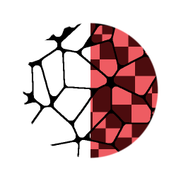

# Flood Fill Mapper

<table>
<tr style="border: 0;">
<td style="border: 0;" valign="top">

## Flood Fill Mapper (Grayscale)

**In:** *Filters/Effects*

**Complex**

</td>
<td style="border: 0;" valign="top">

## Description

Flood Fill Mapper allows remapping of an existing Pattern or Texture onto every single cell from a [Flood Fill](../../../../../../compositing-graphs/nodes-reference-for-com/node-library/filters/effects/flood-fill/flood-fill.md). It is different from other Flood Fill conversions like [Random Grayscale](../../../../../../compositing-graphs/nodes-reference-for-com/node-library/filters/effects/flood-fill-random-gra/flood-fill-to-random-grayscale.md) or [Gradient](../../../../../../compositing-graphs/nodes-reference-for-com/node-library/filters/effects/flood-fill-to-gradient/flood-fill-to-gradient.md) in that it does not generate solid colors or values, but allows you to use you own input maps. It can be seen as a sort of combination of [Flood Fill](../../../../../../compositing-graphs/nodes-reference-for-com/node-library/filters/effects/flood-fill/flood-fill.md) and [Tile Sampler](../../../../../../compositing-graphs/nodes-reference-for-com/node-library/texture-generators/patterns/tile-sampler/tile-sampler.md) or [Shape Mapper](../../../../../../compositing-graphs/nodes-reference-for-com/node-library/texture-generators/patterns/shape-mapper/shape-mapper.md), as it provides quite a few similar controls and interfaces.

The Color version has additional controls to work with Normal Maps, where it can [compensate for tangent-space Normap Map rotations](../../../../../../compositing-graphs/nodes-reference-for-com/node-library/filters/normal-map/normal-vector-rotation/normal-vector-rotation.md).

## Parameters

### Inputs

* **Flood Fill Bbox**: *Color Input*Standard Flood Fill input, required.
* **Pattern Input 1-8**: *Grayscale/Color Input*  
   Custom pattern image input.
* **Pattern Distribution Map**: *Grayscale Input*ID Map to determine which pattern goes to which cell. Can come from other Flood Fill Map such as Flood Fill to Index.
* **Scale Map**: *Grayscale Input*Map to determine Scale per cell.
* **Rotation Map**: *Grayscale Input*Map to determine Rotation per Cell.
* **Luminance Offset Map**: *Grayscale Input*Map to set Luminance per Cell

### Parameters

* **Tiling Mode**: *No Tiling, H+V*Set wether to use Tiling or not. Only visible if Size or Scale ar set below 1.
* **Pattern**   
  * **Pattern Input Number**: *1 - 8*Set amount of Custom Pattern Inputs to use.
  * **Pattern Distribution Mode**: *Random, Shape Size, Distribution Map Input*Set the method to determine what Pattern is shown in a Cell.
  * **Pattern Distribution Jittering**: *0.0 - 1.0*Allows for a slight varaition or Offset in the Pattern distribution without changing everything through teh Random Seed.
* **Size**   
  * **Size Mode**: *Relative to Texture, Relative to Shape BSphere, Relative to Largest Shape, Relative to Smallest Shape, Fit Shape BBox*Set how the size of the pattern in each cell is determined.
  * **Size**: *0.0 - 1.0*Allows for non-uniform scaling of the Pattern.
  * **Scale**: *0.0 - 1.0*  
     Set the global (uniform) scale for the effect.
  * **Scale Map Mulitplier**: *0.0 - 1.0*Set influence of the optional Scale Map.
  * **Scale Random**: *-1.0 - 1.0*Set the amount of random variation within pattern scale.
* **Rotation**   
  * **Rotation**: *0.0 - 1.0*Set global, uniform rotation for every cell.
  * **Rotation Map Mulitplier**: *0.0 - 1.0*Set influence of the optional Rotation map.
  * **Rotation Random**: *0.0 - 1.0*Set the amount of random rotation for every cell.
  * **Rotation Autoscale**: *False/True*Set if a pattern should adjust its scale to fit within a cell when rotated.
* **Position**   
  * **Position Offset**: *0.0 - 1.0*Set global Position offset for every cell.
  * **Position Offset Alignment**: *Texture, Pattern*Set to either align the offset 0-point to the Pattern cell or to the texture.
  * **Position Offset Random**: *0.0 - 1.0*Set the amount of per-cell Position offset randomisation.
* **Color** (Only for Grayscale version)  
  * **Luminance Range**: *0.0 - 1.0*Sets the global contrast on the texture, where 0 becomes middle gray.
  * **Luminance Range Random**: *0.0 - 1.0*Sets the amount of randomisation for the Luminance Range.
  * **Luminance Offset**: *-1.0 - 1.0*Sets the offset for the Luminance, working as a brightness control.
  * **Luminance Offset Random**: *0.0 - 1.0*Sets the amount of randomisation for the Luminance Offset.
  * **Luminance Offset Map Mulitplier**: *0.0 - 1.0*Sets the influence of the optional Luminance Offset map.
  * **Background Color**: *(Grayscale value)*Sets the background color onto which textures are blended.
* **Color** (Only for Color version)
  * **Is Normal Map**: *False/True*Set to interpret Pattern Input as a Normal Map. Will compensate and fix Normal Tangent space rotation.
  * **Normal Format**: *DirectX, OpenGL*  
     Switch between different Normal Map formats (inverts the green channel). Only Active when Is Normal Map is True.
  * **HSL Adjustment**: *-1.0 - 1.0*Adjust HSL globally.
  * **HSL Random**: *-1.0 - 1.0*Set HSL randomisation per cell.
  * **Alpha Adjustment**: *-1.0 - 1.0*Set global Alpha adjustment, reduces Alpha contrast.
  * **Alpha Random**: *-1.0 - 1.0*Set Alpha Adjustment randomisation per cell.
  * **Background Color**: *(Color value)*Sets the background color onto which textures are blended.

.

## Example Images

</td>
</tr>
</table>
