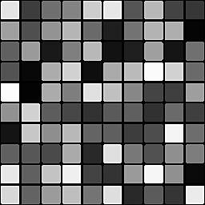

# Flood Fill to Random Grayscale

<table>
<tr style="border: 0;">
<td style="border: 0;" valign="top">

{width="128px"}

## Flood Fill to Random Grayscale

**In:** *Filters/Effects*

**Simple**

</td>
<td style="border: 0;" valign="top">

## Description

Generates random grayscale Luminance values from a [Flood Fill](../../../../../../compositing-graphs/nodes-reference-for-com/node-library/filters/effects/flood-fill/flood-fill.md) base. Useful for adding Luminance variation to tiles.

## Parameters

*No Parameters.*

## Example Images

| 

 | 

 |
| --- | --- |
|  |  |

</td>
</tr>
</table>
