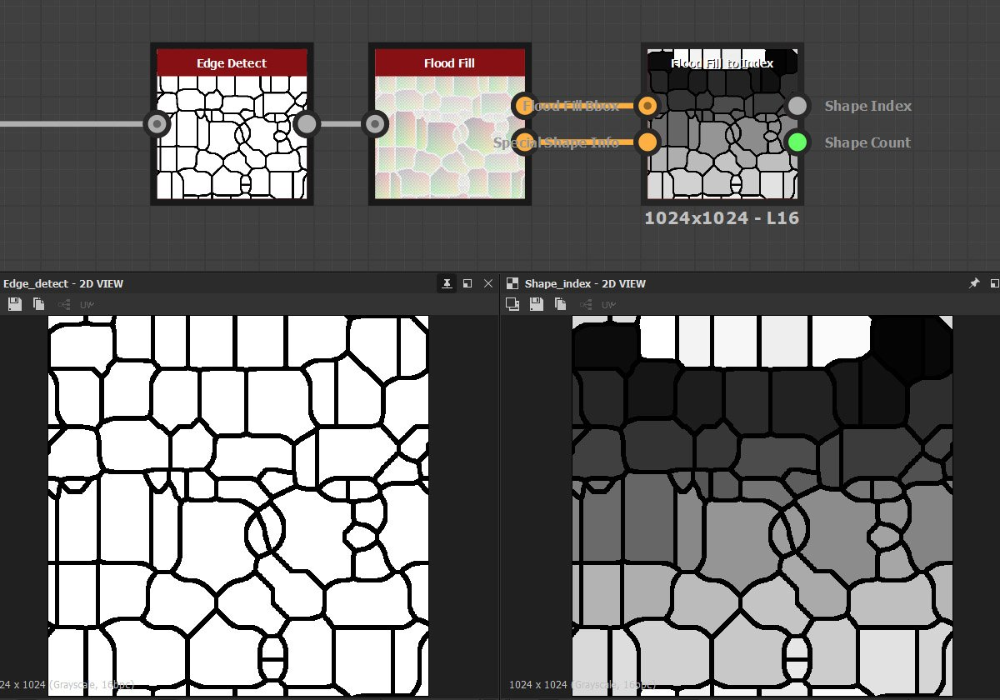

# Flood Fill to Index

<table>
<tr style="border: 0;">
<td style="border: 0;" valign="top">

{width="200px"}

## Flood Fill to Index

**In:** *Filters/Effects*

**Complex**

</td>
<td style="border: 0;" valign="top">

## Description

Flood Fill to Index converts every Flood Fill cell to a value according to its index number, starting with 0 in the top left corner. It can be used to return grayscale tints in a normalised form (0.0 to 1.0, divided by as many cells as found by Flood Fill) or as an HDR, unclamped value (0 to n where n is the number of cells).

Additionally, Flood Fill to Index makes use of the new [Value system, returning extra Values](https://helpx.adobe.com/substance-3d/unlisted/documentation/sddoc/values-in-substance-3d-graphs-180192235.html) containing the amount of shapes found and the optional, internal data table.

### Inputs

* **Flood Fill Bbox**: *Color Input*Standard Flood Fill input map. Required.
* **Special Shape Info**: *Color Input*Extra Flood Fill map, needs to be explicitely enabled on previous Flood Fill node and is required to be connected!.

### Parameters

* **Output**: *Normalised, Integer*Determine if out put is in LDR 0-1 range or HDR 0-n range.
* **Ignore Shape Smaller Than**: *0.0 - 1.0*Tolerance value for ignoring small shapes.
* **Show Flood Fill Data Table**: *False/True*Returns extra (debug) data for advanced use.

## Examples

</td>
</tr>
</table>

 