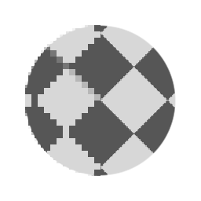

# FXAA

<table>
<tr style="border: 0;">
<td style="border: 0;" valign="top">

## FXAA (Color/Grayscale)

**In:** *Filters/Effects*

**Simple**

</td>
<td style="border: 0;" valign="top">

## Description

Applies an anti aliasing filter based on the FXAA algorithm. You can use this to fix jagged, pixelated edges on shapes. It's especially useful for something like a [Disc Shape](../../../texture-generators/patterns/shape/shape.md) that has pixelated edges, as it provides a simple, one node solution to Anti-Alias edges.

## Example Images

</td>
</tr>
</table>
