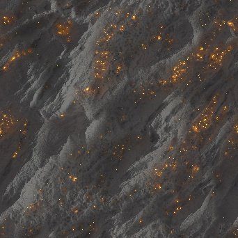

# RT Irradiance

<table>
<tr style="border: 0;">
<td width="41.60%" style="border: 0;" valign="top">

{width="128px"}

**In:** *Filters/Effects*

**Complex**

</td>
<td width="58.30%" style="border: 0;" valign="top">

## Description

Generates ray traced irradiance on a height map input generated from an environment map and an emissive map. Can be used to "bake" lighting into a texture inside a graph. Used for fake global illumination and glow.This node should not be used in combination with the CPU (SSE) engine due to computation time. Returns two maps: one Irradiance output where the irradiance is applied to the material inputs, one raw irradiance map containing just the calculated irradiance values.

</td>
</tr>
</table>

## Parameters

### Inputs

* **Height:** *Grayscale input*Height is the only required input from the material slot. Without it, the node will not function well.
* **Emissive:** *Color input*Emissive should be in a format where pure black emits no light, any other colored value emits light. Alpha is ignored. A connection to this slot, or the Environment slot is required to see any result.
* **Environment**: *Color Input*   
  HDR Lighting environment to compute the irradiance with. A connection to this slot, or the Emissive slot is required to see any result.

### Parameters

* **Height Scale**: *0.0 - 1.0*  
  Scale to interpret height at. Affects entire scene look.
* **Quality**: *32 rays, 64 rays, 128 rays*  
  Determines result quality, but also affects performance. Less rays means more noise.
* **Compute Bounces**: *False/True*  
  Toggle computing of bounces. Affects quality and speed.
* **Environment Rotation**: *0.0 - 1.0*  
  Rotate the environment around.
* **Environment Exposure (EV)**: *-4.0 - 4.0*  
  Exposure value to use for environment, affects total brightness of effect.
* **Emissive Intensity**: *0.0 - 20.0*  
  Multiplier for the Emissive input, affects strength of irradiance from emissive.
* **Emissive Color Space**: *sRGB, Linear*  
  Colorspace used to interpret the Enissive input.
* **IBL Shadows in Raw Irradiance Alpha**: *False/True*  
  Toggle wether to add Shadows to the
* **Emissive LOD Bias**: *-1.0 - 1.0*Tune Quality of the emissive irradiance. Lower value means more noise.

## Example Images

| 

 | 

 | 

 |
| --- | --- | --- |
|  |  |  |
