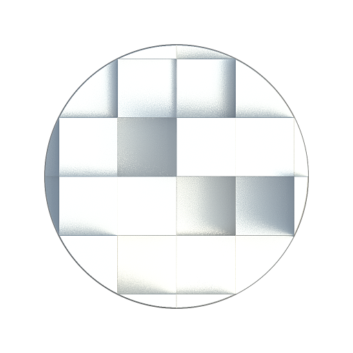

# RT Irradiance

<table>
<tr style="border: 0;">
<td width="33.33%" style="border: 0;" valign="top">

{width="128px"}

<b>In:</b> Filters &gt; Effects

</td>
<td width="100.00%" style="border: 0;" valign="top">

## Description

Generates ray traced irradiance on a height map input generated from an environment map and an emissive map. Can be used to "bake" lighting into a texture inside a graph. Used for fake global illumination and glow.This node should not be used in combination with the CPU (SSE) engine due to computation time. Returns two maps: one Irradiance output where the irradiance is applied to the material inputs, one raw irradiance map containing just the calculated irradiance values.

</td>
</tr>
</table>

## Inputs

|  |  |
|:---|:---|
| <b>Height</b> <i>Grayscale input</i> | Height is the only required input from the material slot. Without it, the node will not function well. |
| <b>Emissive</b> <i>Color input</i> | Emissive should be in a format where pure black emits no light, any other colored value emits light. Alpha is ignored. A connection to this slot, or the Environment slot is required to see any result. |
| <b>Environment</b> <i>Color Input</i> | HDR Lighting environment to compute the irradiance with. A connection to this slot, or the Emissive slot is required to see any result. |

## Parameters

|  |  |
|:---|:---|
| <b>Height Scale</b> <i>0.0 - 1.0</i> | Scale to interpret height at. Affects entire scene look. |
| <b>Quality</b> <i>32 rays, 64 rays, 128 rays</i> | Determines result quality, but also affects performance. Less rays means more noise. |
| <b>Compute Bounces</b> <i>False/True</i> | Toggle computing of bounces. Affects quality and speed. |
| <b>Environment Rotation</b> <i>0.0 - 1.0</i> | Rotate the environment around. |
| <b>Environment Exposure (EV)</b> <i>-4.0 - 4.0</i> | Exposure value to use for environment, affects total brightness of effect. |
| <b>Emissive Intensity</b> <i>0.0 - 20.0</i> | Multiplier for the Emissive input, affects strength of irradiance from emissive. |
| <b>Emissive Color Space</b> <i>sRGB, Linear</i> | Colorspace used to interpret the Enissive input. |
| <b>IBL Shadows in Raw Irradiance Alpha</b> <i>False/True</i> | Toggle wether to add Shadows to the |
| <b>Emissive LOD Bias</b> <i>-1.0 - 1.0</i> | Tune Quality of the emissive irradiance. Lower value means more noise. |

## Examples

<table style="margin-top: 32px; margin-bottom: 32px">
    <tr style="border: 0">
        <td style="border: 0; background: transparent">
            
        </td>
        <td style="border: 0; background: transparent">
            
        </td>
        <td style="border: 0; background: transparent">
            
        </td>
    </tr>
</table>
