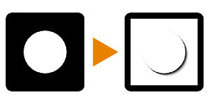

# Shadows (Filter Node)

<table>
<tr style="border: 0;">
<td style="border: 0;" valign="top">

{width="128px"}

## Shadows

**In:** *Filters/Effects*

**Simple**

</td>
<td style="border: 0;" valign="top">

## Description

A raw, grayscale-only version of the [Shape Drop Shadow](../shape-drop-shadow/shape-drop-shadow.md) node. It only takes a black and white, binary shapes as input and returns only the shadow.

Can be useful if you're just after the shadow and do not want to work with a more complete node, for example when building your own material or baked lighting.

## Parameters

* **Shadow Distance**: *0.0 - 1.0*Controls how far away the shadow should fall.
* **Light Angle**: *0.0 - 1.0*Controls the incidence angle of the light.
* **Edges Softness**: *0.0 - 1.0*Determines how hard or soft the shadows edges are.
* **Samples**: *1 - 16*Sets quality for the Edges Softness setting.

## Example Images

| 

 |
| --- |
|  |

</td>
</tr>
</table>
