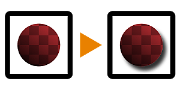

# Shape Drop Shadow

<table>
<tr style="border: 0;">
<td width="33.33%" style="border: 0;" valign="top">

{width="128px"}

{width="128px"}

<b>In:</b> Filters &gt; Effects

</td>
<td width="100.00%" style="border: 0;" valign="top">

## Description

Performs the well-known "Drop Shadow" effect from other 2D image processing software, on an input black and white mask (for the grayscale version) or image with transparency (for the color version).

It differs from the [Shadows](../../../../../../compositing-graphs/nodes-reference-for-com/node-library/filters/effects/shadows-filter-node/shadows-filter-node.md) effect in that it returns images with full transparency applied, making for a more complete effect similar to what you'd expect in other software.

</td>
</tr>
</table>

## Parameters

|  |  |
|:---|:---|
| <b>Angle</b> <i>0.0 - 1.0</i> | Incidence Angle of the (fake) light. |
| <b>Distance</b> <i>-0.5 - 0.5</i> | Distance the shadow drop down to/moves away from the shape. |
| <b>Size</b> <i>0.0 - 1.0</i> | Controls blurring/fuzzines of the shadow. |
| <b>Spread</b> <i>0.0 - 1.0</i> | Cutoff/treshold for the blurring effect, makes the shadow spread away further. |
| <b>Opacity</b> <i>0.0 - 1.0</i> | Blending Opacity for the shadow effect. |
| <b>(Shadow) Color</b> <i>(Color value)</i> | Color tint to be applied to the shadow. |
| <b>Mask Color</b> <i>(Color value) (Grayscale Version Only)</i> | Solid color to be used for the transparency mapped output. |
| <b>Input Is Pre-Multiplied</b> <i>False/True (Color Version Only)</i> | Whether the input should be assumed as pre-multiplied. |
| <b>Pre-Multiply Output</b> <i>False/True</i> | Whether the output should be pre-multiplied. |

## Examples

<table style="margin-top: 32px; margin-bottom: 32px">
    <tr style="border: 0">
        <td style="border: 0; background: transparent">
            
        </td>
    </tr>
</table>
