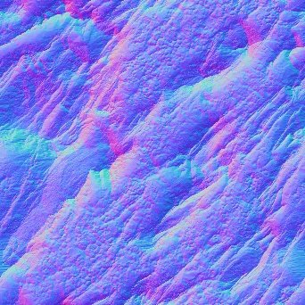

# Bent Normal

<table>
<tr style="border: 0;">
<td width="41.60%" style="border: 0;" valign="top">

<b>In:</b> *Filters/Normal Map*

</td>
<td width="58.30%" style="border: 0;" valign="top">

## Description

Generates a Bent Normal Map based on a height map input. A Bent Normal map is a special version of [Normal](../../../../../../compositing-graphs/nodes-reference-for-com/atomic-nodes/normal/normal.md) and [Ambient Occlusion (RTAO)](../../../../../../compositing-graphs/nodes-reference-for-com/node-library/filters/effects/ambient-occlusion-rtao/ambient-occlusion-rtao.md), generating a normal map with embedded ambient occlusion.  
This can be used in realtime engines to have Ambient Occlusion baked into the normalmap, for instance for more accurate occlusion reflections on metals.

This node should not be used in combination with the CPU (SSE) engine due to computation time.

</td>
</tr>
</table>

## Parameters

<b>Use Physical Size</b> *Boolean*  
Toggle to use Physical Size settings to determine the height scale.

<b>Physical Size</b> *Float3* (Available when <b>Use Physical Size</b> is set to *True*)  
Adjusts the height scale based on the real physical size of the surface.

<b>Samples</b> *Integer*  
Number of rays used to compute the bent normal.  
A higher provides a smoother and more precise result at the cost of performance.

<b>Height Scale</b> *Float (Available when Use Physical Size is set to False)*  
Multiplier for the intensity of the height map input.

<b>Distribution</b> *Integer*  
Sets the distribution method. Affects falloff towards shadowed areas.

<b>Maximum Distance</b> *Float*  
Sets the maximum distance rays can travel to be occluded.

<b>Spread Angle</b> *Float*  
Sets the spreading angle for the rays to be shot at. A value of 1 is a full hemisphere.

<b>Normal Format</b> *Integer*  
Inverts the output's green channel.

## Example Images

