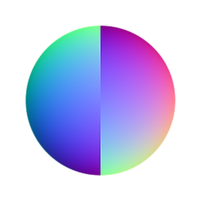

# Normal Invert

<table>
<tr style="border: 0;">
<td style="border: 0;" valign="top">

{width="128px"}

## Normal Invert

**In:** *Filters/Normal Map*

**Simple**

</td>
<td style="border: 0;" valign="top">

## Description

Allows you to invert any and all channels of a Normalmap, providing a quick and easy shortcut to doing this manually.

Keep in mind that almost every node that uses a Normalmap as input or output has an option to invert the Green channel, for DirectX or OpenGL style Normalmaps. This means that for those cases, you should almost never need this node.

## Parameters

* **Invert Red**: *False/True*
* **Invert Green**: *False/True*
* **Invert Blue**: *False/True*
* **Invert Alpha**: *False/True*

## Example Images

|  |
| --- |
| There are no images attached to this page. |

</td>
</tr>
</table>
