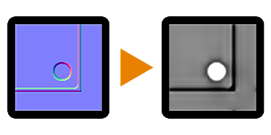

# Normal to Height

<table>
<tr style="border: 0;">
<td style="border: 0;" valign="top">

{width="128px"}

## Normal to Height

**In:** *Filters/Normal Map*

**Intermediate**

</td>
<td style="border: 0;" valign="top">

## Description

A reverse-conversion node that attempts to convert a tangent-space Normalmap back into a Heightmap. This is the slightly simpler version; [Normal to Height HQ](../../../../../../help/compositing-graphs/nodes-reference-for-com/node-library/filters/normal-map/normal-to-height-hq/normal-to-height-hq.md) has more options.

Useful for when you only have a Normalmap source, yet still want to perform operations combining it with a Heightmap. Keep in mind that this will never be able to provide a 100% correct result, as information is lost by nature of the process when Height is converted to Normal. If you tune the settings accordingly, this Non-HQ version does do a decent job of converting simple details.

## Parameters

* **Relief Balance**: *0.0 - 1.0*Adjust the extent to which the different frequencies influence the final result. This is largely dependent on the input map and requires a fair bit of tweaking.
* **Normal Format**: *DirectX, OpenGL*  
  Switches between different Normalmap formats (inverts the green channel).
* **Global Opacity**: *0.0 - 1.0*Adjusts the global opacity of the effect.

## Example Images

| 

 |
| --- |
|  |

</td>
</tr>
</table>
