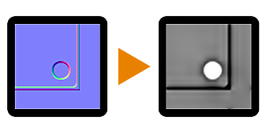

# Normal to Height

<table>
<tr style="border: 0;">
<td width="33.33%" style="border: 0;" valign="top">

{width="128px"}

<b>In:</b> Filters &gt; Normal Map

</td>
<td width="100.00%" style="border: 0;" valign="top">

## Description

A reverse-conversion node that attempts to convert a tangent-space Normalmap back into a Heightmap. This is the slightly simpler version; [Normal to Height HQ](../../../../../../compositing-graphs/nodes-reference-for-com/node-library/filters/normal-map/normal-to-height-hq/normal-to-height-hq.md) has more options.

Useful for when you only have a Normalmap source, yet still want to perform operations combining it with a Heightmap. Keep in mind that this will never be able to provide a 100% correct result, as information is lost by nature of the process when Height is converted to Normal. If you tune the settings accordingly, this Non-HQ version does do a decent job of converting simple details.

</td>
</tr>
</table>

## Parameters

|  |  |
|:---|:---|
| <b>Relief Balance</b> <i>0.0 - 1.0</i> | Adjust the extent to which the different frequencies influence the final result. This is largely dependent on the input map and requires a fair bit of tweaking. |
| <b>Normal Format</b> <i>DirectX, OpenGL</i> | Switches between different Normalmap formats (inverts the green channel). |
| <b>Global Opacity</b> <i>0.0 - 1.0</i> | Adjusts the global opacity of the effect. |

## Examples

<table style="margin-top: 32px; margin-bottom: 32px">
    <tr style="border: 0">
        <td style="border: 0; background: transparent">
            
        </td>
    </tr>
</table>
