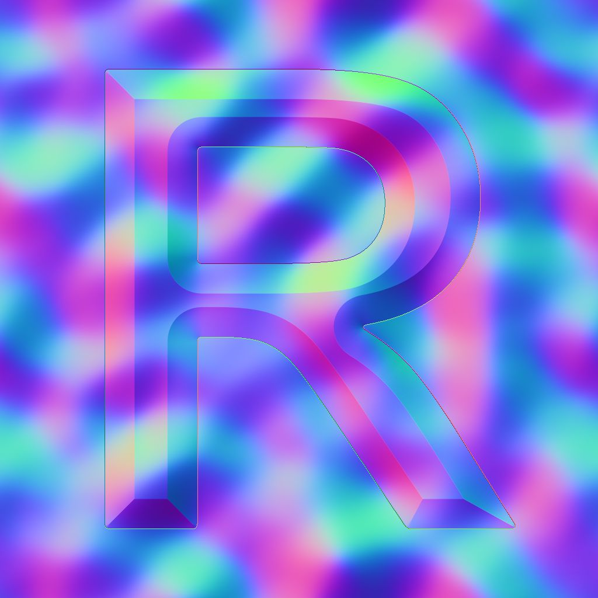
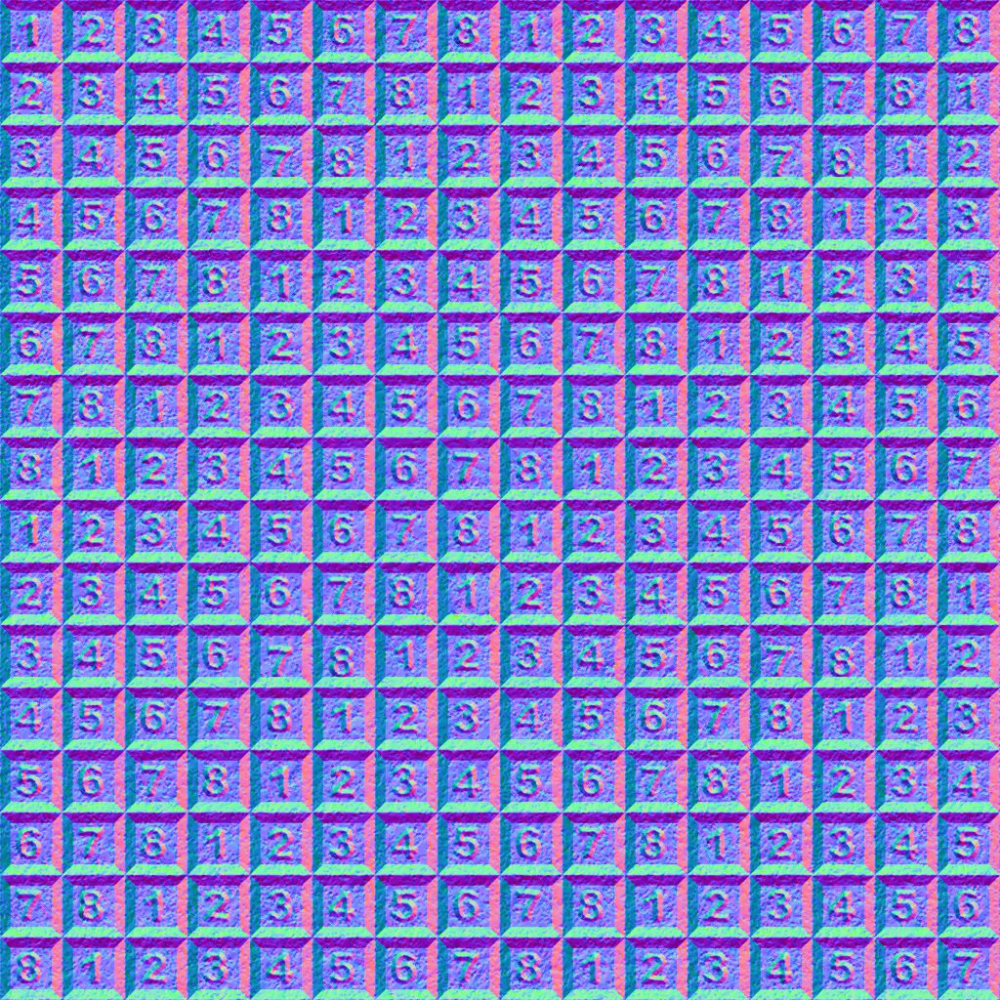

# Normal Uncombine

<table>
<tr style="border: 0;">
<td width="33.33%" style="border: 0;" valign="top">

{width="200px"}

<b>In:</b> Filters &gt; Normal map

</td>
<td width="100.00%" style="border: 0;" valign="top">

## Description

Removes from a normal map the surface details described by a height map.

</td>
</tr>
</table>

## Inputs

|  |  |
|:---|:---|
| <b>Combined normal</b> <i>Color</i> PRIMARY | The normal map from which details should be removed. |
| <b>Height</b> <i>Grayscale</i> | The height map representing the surface details which should be removed from the combined normal map. |

## Outputs

|  |  |
|:---|:---|
| <b>Uncombined normal</b> <i>Color</i> | The normal map where the surface details described by the input height map were removed. |
| <b>Guessed intensity</b> <i>Float</i> | An estimate of the intensity which should be set to a [Normal](../../../../../../compositing-graphs/nodes-reference-for-com/atomic-nodes/normal/normal.md) node connected to the input height map, to match the intensity of the input normal map. |

## Parameters

|  |  |
|:---|:---|
| <b>Normal format</b> *Integer* | The format of the input normal map. Effectively inverts the green channel.<ul data-preserve-html="true"> <li data-preserve-html="true"><b>DirectX:</b> The Y axis points up</li> <li data-preserve-html="true"><b>OpenGL:</b> The Y axis points down</li> </ul> |

## Examples

<table>
  <tr>
    <td>
      
       <i>Before</i>
    </td>
    <td>
      
       <i>After</i>
    </td>
  </tr>
</table>

{zoomable="yes"}

<table>
  <tr>
    <td>
      
       <i>Before</i>
    </td>
    <td>
      
       <i>After</i>
    </td>
  </tr>
</table>

{zoomable="yes"}

<table>
  <tr>
    <td>
      
       <i>Before</i>
    </td>
    <td>
      
       <i>After</i>
    </td>
  </tr>
</table>

{zoomable="yes"}
