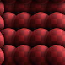

# Make It Tile Patch

<table>
<tr style="border: 0;">
<td style="border: 0;" valign="top">

## Make It Tile Patch (Grayscale)

**In:** *Filters/Tiling*

**Complex**

</td>
<td style="border: 0;" valign="top">

## Description

This node is a grid-based semi-random tiler. It takes an input patch and stamps it around, attempting to turn it into a tiling image without too many repetitions, based on your settings.

Useful for when you have a small patch of texture and want to create a larger scale, tiling texture from it.

Keep in mind that this is different from [Make-It-Tile Photo](../../../../../../compositing-graphs/nodes-reference-for-com/node-library/filters/tiling/make-it-tile-photo/make-it-tile-photo.md), which mainly fixes up edges.

To do this with an entire material, see [Smart Auto Tile](../../../../../../compositing-graphs/nodes-reference-for-com/node-library/material-filters/scan-processing/smart-auto-tile/smart-auto-tile.md).

## Parameters

* **Mask Size**: *0.0 - 1.0*Size of the round mask used when stamping the patch.
* **Mask Precision**: *0.0 - 1.0*Falloff/smoothness precision of the mask.
* **Mask Warping**: *-100.0 - 100.0*Introduces warping at mask edges. Good for avoiding smooth, undefined transitions between patches.
* **Pattern size width**: *0.0 - 1000.0*Changes the width of the patch non-uniformly.
* **Pattern size height**: *0.0 - 1000.0*Changes the height of the patch non-uniformly.
* **Disorder**: *0.0 - 1.0*  
  Introduces translational randomness, slightly shifting patches around.
* **Size Variation**: *0.0 - 100.0*Introduces size variation for the mask.
* **Octave**: *0 - 6*This is the main control that determines the overal size.
* **Rotation**: *-360.0 - 360.0*Pre-rotates the patch.
* **Rotation Variation**: *0.0 - 360.0*Introduces random rotation for every patch stamp.
* **Background Color**: *(Color value)*Sets the background color for areas where no patch appears.
* **Color Variation**: *0.0 - 1.0 (Color Version Only)*Introduces color variation per patch.
* **Luminosity Variation** *(grayscale version only)*Introduces luminosity variation per patch.

## Example Images

</td>
</tr>
</table>
