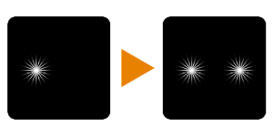

# Clone (Filter Node)

<table>
<tr style="border: 0;">
<td style="border: 0;" valign="top">

## Clone

**In:** *Filters/Transforms*

**Intermediate**

</td>
<td style="border: 0;" valign="top">

## Description

Clones input image once to a specified location. Can function as a crude "clone stamp" tool.

Requires some care to get the intended results:

* Ideally, the input image will have an alpha channel (like a decal), since blending is just a straight copy.
* Mask defaults to black, so to see any results a uniform white grayscale value needs to be plugged in at least.
* Offset will clip outside of the image easily, so use small values.

## Parameters

### Inputs

* **Source**: *Color Input*   
  Image to clone. Important: ideally, the image will have an alpha channel!
* **Mask**: *Grayscale Input*   
  Mask slot used for masking the node's effects. Defaults to black!

### Parameters

* **Offset**: *-*   
  Moves or translates the result. Positive is Left and Up, Negative is Right and Down. Use small values, 1.0 and above moves it outside of the image!
* **Blur Mask**: *0.0 - 10.0  
  Apply a blur filter to mask, to soften edges.*

## Example Images

| 

 |
| --- |
|  |

</td>
</tr>
</table>
