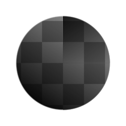

# Mirror (Filter Node)

<table>
<tr style="border: 0;">
<td style="border: 0;" valign="top">

{width="128px"}

{width="128px"}

## Mirror (Grayscale)

**In:** *Filters/Transforms*

**Intermediate**

</td>
<td style="border: 0;" valign="top">

## Description

Mirrors the input image over a chosen axis, from a chosen side. Very useful, quick way to get symmetrical effects.

## Parameters

* **Mode**: *Mirror Axis X, Mirror Axis Y, Mirror* *Corner*Choose to mirror left-right, top-bottom, or both.
* **Axis X Offset**: *0.0 - 1.0*Only used when Axis X is chosen, define an offset.
* **Axis Y Offset**: *0.0 - 1.0*Only used when Axis Y is chosen, define an offset.
* **Invert Axis X**: *False/True*Only used when Axis X is chosen, Flip direction.
* **Invert Axis Y**: *False/True*Only used when Axis Y is chosen, Flip direction.
* **Corner Type**: *Top Left, Top Right, Bottom Left, Bottom Right*Only used when Corner type is chosen, define what corner to mirror from.

## Example Images

| 

 |
| --- |
|  |

</td>
</tr>
</table>
