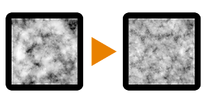

# Noise Upscale 2

<table>
<tr style="border: 0;">
<td style="border: 0;" valign="top">

{width="128px"}

## Noise Upscale 2

**In:** *Filters/Transforms*

**Simple**

</td>
<td style="border: 0;" valign="top">

## Description

Takes an input noise procedural and scales it up to double resolution, keeping detail but without introducing too much tiling. Uses an "X" type of mask and blends with less contrast than the original input (internal blend modes are Max and Min).

This node is mostly intended for optimising slow graphs that use heavy, big noises. It allows you to use higher resolutions without introducing too much extra compute time.

See also [Noise Upscale 1](../../../../../../help/compositing-graphs/nodes-reference-for-com/node-library/filters/transforms/noise-upscale-1/noise-upscale-1.md) and [Noise Upscale 3](../../../../../../help/compositing-graphs/nodes-reference-for-com/node-library/filters/transforms/noise-upscale-3/noise-upscale-3.md) for different variations of this process.

## Parameters

* **Offset1X**: *0.0 - 1.0*Slides top and bottom parts over X axis.
* **Offset1Y**: *0.0 - 1.0*  
  Slides top and bottom parts over Y axis.
* **Offset2X**: *0.0 - 1.0*Slides left and right parts over X axis.
* **Offset2Y**: *0.0 - 1.0*Slides left and right parts over Y axis.

## Example Images

| 

 |
| --- |
|  |

</td>
</tr>
</table>
