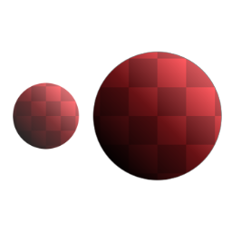
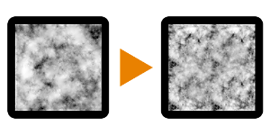

# Noise Upscale 3

<table>
<tr style="border: 0;">
<td style="border: 0;" valign="top">

{width="128px"}

## Noise Upscale 3

**In:** *Filters/Transforms*

**Simple**

</td>
<td style="border: 0;" valign="top">

## Description

Takes an input noise procedural and scales it up to double resolution, keeping detail but without introducing too much tiling. Uses a user-defined mask to blend noise on top of its original scale.

This node is mostly intended for optimising slow graphs that use heavy, big noises. It allows you to use higher resolutions without introducing too much extra compute time.

See also [Noise Upscale 1](../noise-upscale-1/noise-upscale-1.md) and [Noise Upscale 2](../noise-upscale-2/noise-upscale-2.md), which in most cases tend to be slightly better at hiding tiling.

## Parameters

### Inputs

* **Grayscale**: *Grayscale Input*   
  Target Noise image.
* **Mask**: *Grayscale Input*   
  Mask slot used for masking the node's effects.

*No Parameters.*

## Example Images

| 

 |
| --- |
|  |

</td>
</tr>
</table>
