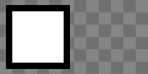

# Non-Square Transform

<table>
<tr style="border: 0;">
<td width="33.33%" style="border: 0;" valign="top">

<b>In:</b> Filters &gt; Transforms

</td>
<td width="100.00%" style="border: 0;" valign="top">

## Description

Nonsquare-safe version of [Transform 2D](../../../../../../compositing-graphs/nodes-reference-for-com/atomic-nodes/transformation-2d/transformation-2d.md). Automatically detects nonsquare ratios and can transform square input images onto a nonsquare canvas.

Make sure you fully understand the [Graph Parameters ](../../../../../../compositing-graphs/graph-parameters/graph-parameters.md)to make the best use of this node, as you will need to set a few settings correctly:

* Your **Graph** Size should be nonsquare, otherwise there is no need for this node.
* Set the Non Square Transform **node's** Output Size to "*Relative to Parent*".
* Set the **node's** tiling mode to "*No Tiling*" if you only want to transform your input to a single position.

</td>
</tr>
</table>

## Parameters

|  |  |
|:---|:---|
| <b>Tile Mode</b> <i>Automatic, Manual</i> | Enable automatic non-square compensations or not. |
| <b>Tile</b> <i>1 - 16</i> | Only accessible when Tile Mode is set to Manual. Allows you to change the scale in a tiling-safe way. |
| <b>Offset</b> <i>0.0 - 1.0</i> | Moves or translates the result. Double-click the slider to enter negative values. |
| <b>Rotation</b> <i>0.0 - 1.0</i> | Rotates the input image. |
| <b>Safe Rotation (Square Only)</b> <i>False/True</i> | Snaps to safe values to maintain sharpness of pixels. |
| <b>Background Color</b> <i>(Color value)</i> | Background color to fill image with. Only visible when [Tiling Mode in Base Parameters is set to "*No Tiling*"](../../../../../../compositing-graphs/graph-parameters/graph-parameters.md). |

## Examples

<table style="margin-top: 32px; margin-bottom: 32px">
    <tr style="border: 0">
        <td style="border: 0; background: transparent">
            
        </td>
    </tr>
</table>
