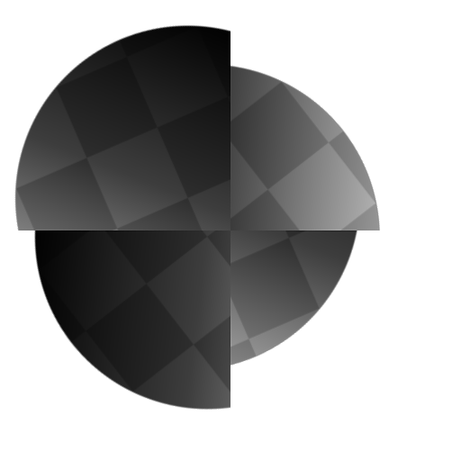
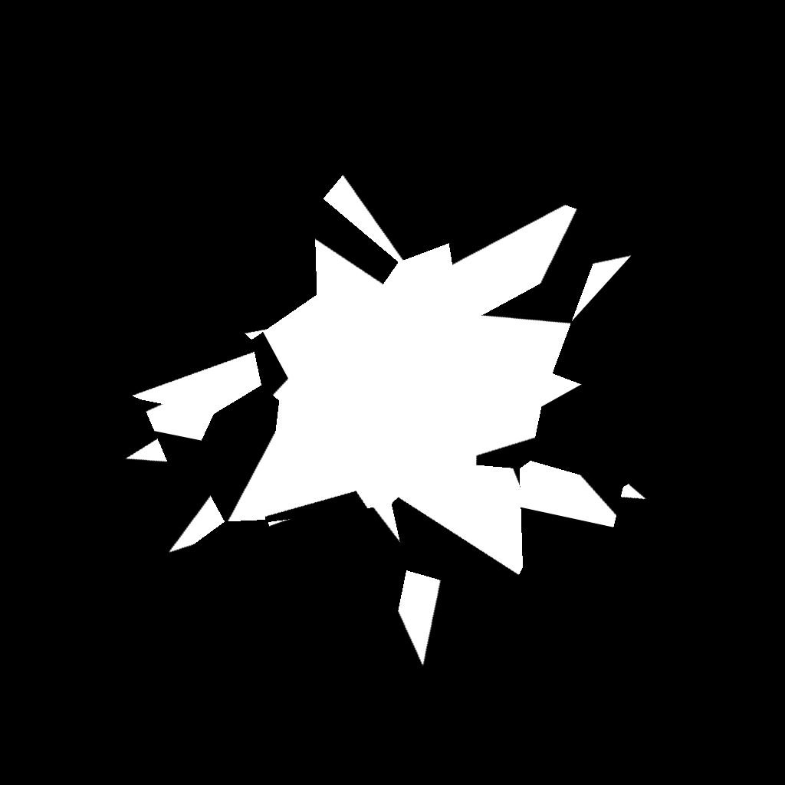

# Non-Uniform Rotation

<table>
<tr style="border: 0;">
<td width="41.60%" style="border: 0;" valign="top">

<table>
<tr style="border: 0;">
<td style="border: 0;" valign="top">

{width="200px"}

</td>
<td style="border: 0;" valign="top">

{width="200px"}

</td>
</tr>
</table>

**In:** Filters*/Transforms*

**Intermediate**

</td>
<td width="58.30%" style="border: 0;" valign="top">

## Description

The **Non-Uniform Rotation** node rotates the **Input** using the **Rotation Map** input.

The values of the image represent a *number of turns*. The rotation is performed around the position specified by the **Pivot Position** value or the **Pivot Position map** input.  
Positive values in the **Rotation Map** input result in a *clockwise* rotation.

</td>
</tr>
</table>

## Parameters

### Inputs

* **Input** *Grayscale/Color*  
  The input grayscale image which should be rotated.
* **Rotation Map** *Grayscale*The map used to control the amount of rotation, in *number of turns*. The sampled values are multiplied against the **Rotation Angle Multiplier**. Negative values result in a *counter-clockwise* rotation.
* **Rotation Pivot Position Map** *Color*  
  The image used to specify the position of the rotation *pivot*. The **X/Y** position is mapped to the **R/G** channels of the image.

### Parameters

* **Rotation Angle Multiplier** *Float*  
  Adjusts the intensity of the **Rotation Map** input.
* **Rotation Angle Offset** *Float*  
  Applies the specified additional amount of rotation.
* **Use Pivot Position Map** *Boolean*  
  Use a *bitmap input* to specify the position of the rotation pivot. The **X/Y** position is mapped to the **R/G** channels of the **Position Map** input.
* **PIvot Position** *Float2*  
  The position of the pivot around which the image is rotated.
* **Background Color** *Float/Float4*  
  Background color to display *outside* of the image's bounds in case the tiling is not set to **H and V Tiling**.
* **Filtering Mode** *Integer*  
  Defines how to treat the sampled results when *interpolating* between pixels:  
  * *Nearest*: will sample exactly the *same* value (faster)  
  * *Bilinear*: will apply a bilinear filter on the result for a *smoother* look

## Example Images

<table>
<tr style="border: 0;">
<td style="border: 0;" valign="top">

{width="768px"}

</td>
<td style="border: 0;" valign="top">

{width="256px"}

</td>
<td style="border: 0;" valign="top">

{width="256px"}

</td>
</tr>
</table>
