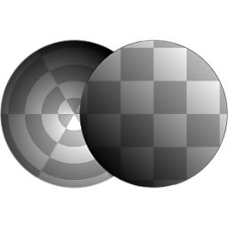

# Polar to Cartesian

<table>
<tr style="border: 0;">
<td style="border: 0;" valign="top">

{width="128px"}

{width="128px"}

## Polar to Cartesian (Grayscale)

**In:** *Filters/Transforms*

**Simple**

</td>
<td style="border: 0;" valign="top">

## Description

Converts an input in Polar Coordinates (Angle &amp; Radius) to Cartesian Coordinates (X &amp; Y). The reverse is possible with [Cartesian to Polar](../cartesian-to-polar/cartesian-to-polar.md).

## Parameters

*No Parameters.*

## Example Images

| 

 |
| --- |
|  |

</td>
</tr>
</table>
