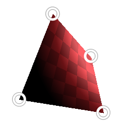

# Quad Transform

<table>
<tr style="border: 0;">
<td style="border: 0;" valign="top">

{width="128px"}

{width="128px"}

## Quad Transform (Grayscale)

**In:** *Filters/Transforms*

**Intermediate**

</td>
<td style="border: 0;" valign="top">

## Description

Special transform node that allows transformation of a quad shape through interaction with its corner points. Allows very specific transforms in a hands-on way.

## Parameters

* **p00**: Top Left Point.
* **p01**: Bottom Left Point
* **p10**: Top Right Point.
* **p11**: Bottom Right Point.
* **Culling**: *Front only, Back only, Front over Back, Back over Front*Set culling/hiding of shape when points cross over each other.
* **Enable Tiling**: *False/True*
* **Background Color**: *(Grayscale value)*Solid background color if tiling is off.
* **Sampling**: *Bilinear, Nearest*Set sampling quality.

## Example Images

</td>
</tr>
</table>
