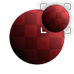

# Safe Transform

<table>
<tr style="border: 0;">
<td style="border: 0;" valign="top">

## Safe Transform (Grayscale)

**In:** *Filters/Transforms*

**Intermediate**

</td>
<td style="border: 0;" valign="top">

## Description

Tiling-safe version of [Transform 2D](../../../../atomic-nodes/transformation-2d/transformation-2d.md). Allows you to scale, rotate and offset without breaking tiling and without losing pixel detail (loss of crispness/sharpness) due to small offsets and rotations.

Useful for transforming noise when maximum control or perfect sharpness is required.

## Parameters

* **Tile**: *1 - 16*Scales the input down by tiling it.
* **Offset Mode**: *Manual, Random*Switches to a random offset instead of a manually defined one.
* **Offset**: *0.0 - 1.0*  
  Moves or translates the result. Makes sure pixels are snapped and not interpolated.
* **Rotation**: *0.0 - 1.0*Rotates input along angle.
* **Tile Safe Rotation**: *False/True*Determines the behaviour of the Rotation, whether it should snap to safe values that don't blur any pixels.
* **Symmetry**: *none, X, Y, X+Y*
* **Background Color**: *(Color value) (Color Version Only)*
* **Mipmap Mode**: *Automatic, Manual*Determines mipmapping mode. Setting this to Manual leads to sharper results.
* **Mipmap Level**: *0 - 10*When Mipmap mode is set to Manual, this allows you to choose a different Mipmap.

## Example Images

|  |
| --- |
| There are no images attached to this page. |

</td>
</tr>
</table>

 