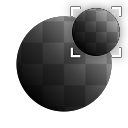

# Safe Transform

<table>
<tr style="border: 0;">
<td width="33.33%" style="border: 0;" valign="top">

<b>In:</b> Filters &gt; Transforms

</td>
<td width="100.00%" style="border: 0;" valign="top">

## Description

Tiling-safe version of [Transform 2D](../../../../../../compositing-graphs/nodes-reference-for-com/atomic-nodes/transformation-2d/transformation-2d.md). Allows you to scale, rotate and offset without breaking tiling and without losing pixel detail (loss of crispness/sharpness) due to small offsets and rotations.

Useful for transforming noise when maximum control or perfect sharpness is required.

</td>
</tr>
</table>

## Parameters

|  |  |
|:---|:---|
| <b>Tile</b> <i>1 - 16</i> | Scales the input down by tiling it. |
| <b>Offset Mode</b> <i>Manual, Random</i> | Switches to a random offset instead of a manually defined one. |
| <b>Offset</b> <i>0.0 - 1.0</i> | Moves or translates the result. Makes sure pixels are snapped and not interpolated. |
| <b>Rotation</b> <i>0.0 - 1.0</i> | Rotates input along angle. |
| <b>Tile Safe Rotation</b> <i>False/True</i> | Determines the behaviour of the Rotation, whether it should snap to safe values that don't blur any pixels. |
| <b>Symmetry</b> <i>none, X, Y, X+Y</i> |  |
| <b>Background Color</b> <i>(Color value) (Color Version Only)</i> |  |
| <b>Mipmap Mode</b> <i>Automatic, Manual</i> | Determines mipmapping mode. Setting this to Manual leads to sharper results. |
| <b>Mipmap Level</b> <i>0 - 10</i> | When Mipmap mode is set to Manual, this allows you to choose a different Mipmap. |
