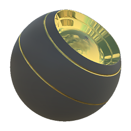

# Material Color Blend

<table>
<tr style="border: 0;">
<td width="33.33%" style="border: 0;" valign="top">

{width="128px"}

<b>In:</b> Material Filters &gt; Blending

</td>
<td width="100.00%" style="border: 0;" valign="top">

## Description

This node allows for adjustments to a Multi Channel, Full Material by blending solid colors on top. This is the main difference with [Material Adjustment Blend](../../../../../../compositing-graphs/nodes-reference-for-com/node-library/material-filters/blending-material/material-adjustment-blend/material-adjustment-blend.md), which only allows for [Levels](../../../../../../compositing-graphs/nodes-reference-for-com/atomic-nodes/levels/levels.md)-type adjustments to channels, whereas this node uses [Blend](../../../../../../compositing-graphs/nodes-reference-for-com/atomic-nodes/blend/blend.md)-type adjustments with a solid color.

This node is most useful when you want to either introduce a flat color hint into Diffuse or Base Color, or went you want to "flatten" out other channels by using a set, solid color value.

</td>
</tr>
</table>

## Inputs

|  |  |
|:---|:---|
| <b>ColorID</b> <i>Color Input</i> | Mask slot used for masking the node's effects. |
| <b>Greyscale Mask</b> <i>Grayscale Input</i> | Mask slot used for masking the node's effects. |

## Parameters

|  |  |
|:---|:---|
| <b>Channels</b> | Toggle material channels on and off in this group, when using Specular/Glossiness maps instead of Metallic/Roughness for example. |
| <b>Diffuse</b> |  |
| <b>Color</b> <i>(Color value)</i> | Which color value to blend on top of the Diffuse Channel. |
| <b>Opacity</b> <i>0.0 - 1.0</i> | Blending Opacity between Foreground and Background. |
| <b>Blending Mode</b> <i>Normal, Add, Subtract, Multiply, Add/Sub, Max, Min, Switch</i> | Blend mode to use in the operation. |
| <b>Base Color</b> | Blends a solid color on top of this channel with options as in the Diffuse group. |
| <b>Normal</b> |  |
| <b>Source</b> <i>Height, Mask</i> |  |
| <b>Blending Mode</b> <i>Combine, Blend</i> |  |
| <b>Height Intensity</b> <i>0.0 - 1.0</i> |  |
| <b>Height Opacity</b> <i>0.0 - 1.0</i> |  |
| <b>Format</b> <i>DirectX, OpenGL</i> |  |
| <b>Specular</b> | Blends a solid color on top of this channel with options as in the Diffuse group. |
| <b>Emissive</b> | Blends a solid color on top of this channel with options as in the Diffuse group. |
| <b>Glossiness</b> | Blends a solid color on top of this channel with options as in the Diffuse group. |
| <b>Roughness</b> | Blends a solid color on top of this channel with options as in the Diffuse group. |
| <b>Metallic</b> | Blends a solid color on top of this channel with options as in the Diffuse group. |
| <b>Specular Level</b> | Blends a solid color on top of this channel with options as in the Diffuse group. |
| <b>Ambient Occlusion</b> | Blends a solid color on top of this channel with options as in the Diffuse group. |
| <b>Height</b> | Blends a solid color on top of this channel with options as in the Diffuse group. |
| <b>Opacity</b> | Blends a solid color on top of this channel with options as in the Diffuse group. |
| <b>Color ID Mask</b> <i>False/True</i> | Use Color ID mask instead of grayscale mask. Keep in mind that this is only for one color!  Enables all the below options. |
| <b>Color</b> <i>(Color value)</i> | Which color to pick and convert to white. |
| <b>Fuzziness</b> <i>0.01 - 1.0</i> | The extent to which the colour you picked blends over into its neighbours. |
| <b>Padding</b> <i>0.0 - 1.0</i> | Transition contrast of the color you picked. |
