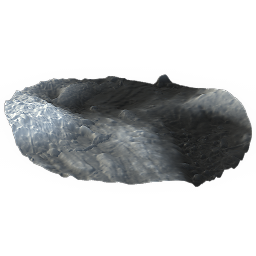

# Height Blend

<table>
<tr style="border: 0;">
<td style="border: 0;" valign="top">

{width="128px"}

## Height Blend

**In:** *Material Filters/Effects*

**Simple**

</td>
<td style="border: 0;" valign="top">

## Description

Combines two Heightmaps based on their height information. Generates a blended Heightmap, but also a Black and White mask that can be used elsewhere.

This is useful when you have two high-quality Heightmaps to combine, but not necessarily a full material, as is required for [Material Height Blend](../../../../../../compositing-graphs/nodes-reference-for-com/node-library/material-filters/effects-material/material-height-blend/material-height-blend.md).

## Parameters

### Inputs

* **Height Top**: *Grayscale Input*
* **Height Bottom**: *Grayscale Input*
* **Mask (optional)**: *Grayscale Input*   
  Mask slot used for masking the node's effects.

### Parameters

* **Height Offset**: *0.0 - 1.0*Offsets Heightmaps so the blend level is moved along the height axis. This is the main control for the blending.
* **Contrast**: *0.0 - 1.0*  
  Adjusts the contrast of the blending, makes transitions sharper.
* **Mode**: *Balanced height, Bottom height priority*Switches between two different blending modes.
* **Opacity**: *0.0 - 1.0*  
  Blending Opacity of the foreground height, fades it in or out.

## Example Images

|  |
| --- |
| There are no images attached to this page. |

</td>
</tr>
</table>
