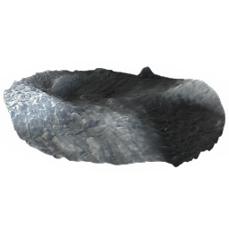

# Height Blend

<table>
<tr style="border: 0;">
<td width="33.33%" style="border: 0;" valign="top">

{width="128px"}

<b>In:</b> Material Filters &gt; Effects

</td>
<td width="100.00%" style="border: 0;" valign="top">

## Description

Combines two Heightmaps based on their height information. Generates a blended Heightmap, but also a Black and White mask that can be used elsewhere.

This is useful when you have two high-quality Heightmaps to combine, but not necessarily a full material, as is required for [Material Height Blend](../../../../../../compositing-graphs/nodes-reference-for-com/node-library/material-filters/effects-material/material-height-blend/material-height-blend.md).

</td>
</tr>
</table>

## Inputs

|  |  |
|:---|:---|
| <b>Height Top</b> <i>Grayscale Input</i> |  |
| <b>Height Bottom</b> <i>Grayscale Input</i> |  |
| <b>Mask (optional)</b> <i>Grayscale Input</i> | Mask slot used for masking the node's effects. |

## Parameters

|  |  |
|:---|:---|
| <b>Height Offset</b> <i>0.0 - 1.0</i> | Offsets Heightmaps so the blend level is moved along the height axis. This is the main control for the blending. |
| <b>Contrast</b> <i>0.0 - 1.0</i> | Adjusts the contrast of the blending, makes transitions sharper. |
| <b>Mode</b> <i>Balanced height, Bottom height priority</i> |  |
| <b>Opacity</b> <i>0.0 - 1.0</i> | Blending Opacity of the foreground height, fades it in or out. |
