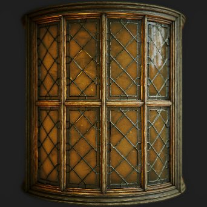

# PBR Render

<table>
<tr style="border: 0;">
<td width="41.60%" style="border: 0;" valign="top">

{width="250px"}

**In:** *Material Filters/PBR Utilities*

**Complex**

</td>
<td width="58.30%" style="border: 0;" valign="top">

## Description

Renders a PBR material onto a sphere, plane or cylinder using Image Based Lighting (IBL).This is a render-engine inside a node, which can be very useful for generating thumbnails, previews or 2D assets. It is not a render like the 3D view, but an actual texture being generated in your graph.

This node requires at least a full PBR material to be plugged in. Ideally you make use of Link Creation Modes to connect the material to PBR Render. Additionally, you will need a spherically-unwrapped HDRI environment for the render to calculate lighting from. Materials for testing can be found under PBR Materials, Environment maps can be found under [3D View in the library.](../../../3d-view-library/3d-view-library.md)

</td>
</tr>
</table>

>[!WARNING]
>
> **CPU (SSE2) Engine**
> 
> The PBR Render Node is very heavy and does not work well with the SSE2 CPU engine. Switch to another engine by pressing F9, if node performs extremely bad.

## Inputs

* **Material channel** **inputs**   
  Multiple material inputs are used to render the material on the geometry:
  * Base Color
  * Normal
  * Emissive
  * Roughness
  * Metallic
  * Specular Level
  * Height
  * Ambient Occlusion
  * Opacity Mask
  * Anisotropy Level
  * Anisotropy Angle
  * Translucency
  * Scattering Distance Scale
* **Lens Dirt Map**: *Grayscale Input*Custom map for dirt on lens, that appears when lens flares are visible.
* **Lens Aperture Map**: *Grayscale Input*Can be used to override Bokeh, out-of-focus shape. The more contrasted, the more visible it is. Keep in mind only a circle within the texture is sampled, so any shape has to fit within a circle.
* **Background input**: *Color input*  
  Custom map used as background when the **Background Mode** parameter is set to *Backgroud Input*
* **Environment Map**: *Color Input*Enviroment map used to calculate lighting. Must be spherically-mapped and in HDR.

Outputs

* **Beauty**  
  The final render
* **Raw Irradiance**  
  The irradiance data of the final render  
  *Alpha:* Opacity map
* **Raw Specular**  
  The specular data of the final render  
  *Alpha:* Specular shadow map
* **Normal World Space**  
  The world space normals data of the final render  
  *Alpha:* World space height map
* **Normal Tangent Space**  
  The tangent space normals data of the final render  
  *Alpha:* Tangent space height map
* **UVs**  
  The UV data of the final render  
  *Alpha:* Opacity map

## Parameters

* **Shape**: *Sphere, Plane, Cylinder*   
  Sets the shape used for rendering. Custom shapes are not possible.
* **Displacement Intensity**: *0.0 - 0.5*Set the intensity of displacement from height.
* **Environment Rotation**: *0.0 - 1.0*   
  Rotates the lighting environment. Pre-rotates compared to moving the camera.
* **Background Mode**: *Color, Environment, Ambient, Background Input*   
  Set what is shown in the background. Color is a solid color, Environment is the map you plugged in with an optional blur. Ambient is a very blurred version of the environment.
* **Background Color**: *(Color value)*   
  Only available when Background mode is set to Color.
* **Environment Background Blur**: *0.0 - 1.0*   
  Only available when Background mode is set to Environment.
* **Shape**    
  * **Scale**: *0.0 - 2.0*   
    Set the scale for the Sphere.
  * **Plane Size**: *0.0 - 1.0*   
    Set the scale for the Plane.
  * **Cylinder Radius**: *0.0 - 1.0*   
    Set the radius for the Cylinder.
  * **Cylinder Length**: *0.0 - 1.0*   
    Set the length for the Cylinder.
  * **Rotation**: *0.0 - 1.0*   
    Rotates shape without rotating lighting.
  * **Rotation Direction**: *0.0 - 1.0*   
    Sets the axis of rotation in 2D.
  * **Rotation Around Direction**: *0.0 - 1.0*   
    Spins shape on the rotation axis.
  * **Shape Position**: *-1.0 - 1.0*   
    Moves shapes.
  * **UV Tiling**: *1.0 - 6.0*   
    Sets the amount of UV-Tiling.
  * **Sphere UV Scale**: *0.0 - 4.0*   
    Sets the scale of UV's on the Sphere.
  * **Plane UV Scale**: *1.0 - 4.0*   
    Sets the scale of UV's on the Plane.
  * **Cylinder UV Scale**: *1.0 - 6.0*   
    Sets the scale of UV's on the Cylinder.
  * **UV Offset**: *0.0 - 1.0*   
    Offsets UV's
  * **Tilt UVs**: *False/True*   
    Tilts UV's by 45 degrees for the Sphere.
* **Camera**    
  * **Exposure**: *-4.0 - 4.0*   
    Set camera exposure.
  * **Tone Mapper**: *Linear, ACES, Filmic Hejl*   
    Set which tone mapping solution to use for the final image.
  * **Camera Mode**: *Perspective, Orthographic*   
    Switch camera between two projection modes.
  * **Field of View**: *0.01 - 100.0*   
    Set camera FOV angle.
  * **Distance**: *0.0 - 4.0*   
    Set the distance of the camera from the object center.
  * **Vignette Intensity**: *0.0 - 1.0*   
    Set intensity of vignette effect.
  * **Vignette Radius**: *0.0 - 1.0*   
    Set radius of the vignette effect.
  * **Screen Position**:  
    Moves the camera around the object, can be changed with a gizmo in the 2D view as well.
* **Depth of Field** 
  * **Aperture Radius** : *0.0 - 0.1*Sets radius of the aperture. Higher values mean out-of-focus areas get blurrier (bokeh).
  * **Aperture Blades**: *3 - 9*   
    Sets the shape of the bokeh blur.
  * **Aperture Ring**: *0.0 - 1.0*   
    Adds an inner gradient to the bokeh shape.
  * **Aperture Difraction**: *0.0 - 2.0*   
    Adds chromatic aberration to the bokeh.
  * **Swirly Bokeh**: *0.0 - 1.0*   
    Adds a swirl or spinning type of effect to out-of-focus bokeh blur areas.
  * **Focus Mode**: *Auto, Point*   
    Set if focus is pre-determined or user-set. Point focus lets you move a point in the 2D view to determine the focus distance.
  * **Focus Point**:  
    If focus is set to Point, this lets you move that point. has a 2D view gizmo.
  * **Focus Offset**: *-0.5 - 0.5*   
    If focus is set to Auto, allows you to shift it back and forth.
  * **Use Custom Aperture Map**: *False/True*   
    Overrides Aperture settings above and use Aperture map input to determine the bokeh shape. Requires an input.
* **Post Effects** 
  * **Enable Post Effects**: *False/True*   
    Toggles *all* post-effects in the final render.
  * **Bloom Intensity** : *0.0 - 2.0*Sets strength of the bloom effect.
  * **Bloom Threshold** : *0.0 - 2.0*Sets low threshold for bloom to appear.
  * **Bloom Chroma Shift** : *0.0 - 1.0*
  * **Lens Halo Intensity** : *0.0 - 1.0*Sets intensity for the lens halo effect.
  * **Lens Flares Intensity** : *0.0 - 1.0*Sets intensity for the lens flare. Make sure the light from your environment background is in view to properly see this effect.
  * **Lens Dirt Intensity** : *0.0 - 1.0*Sets effect of lens dirt map on the Lens flares.
* **Render Settings**    
  * **Diffuse Quality**: *16 Samples, 32 Samples, 64 Samples, 128 Samples*   
    Switch between quality levels for the diffuse map.
  * **Diffuse Emissive Mulitplier**: *0.0 - 1.0*   
    Controls how much the emissive parts are contributing to the irradiance.
  * **Diffuse Shadow Intensity**: *0.0 - 1.0*   
    Controls the intensity of the diffuse shadows.
  * **Specular Dithering**: *0.0 - 1.0*   
    Set the amount of dithering for the specular.
  * **Specular Shadow Multiplier**: *0.0 - 1.0*   
    Controls the intensity of shadows in the specular reflections.
  * **Opacity Mode** *Dithered Alpha test, Simple Alpha Blend*  
    Controls the method of applying transparency. The *Simple Alpha Blend* mode is most visible on uniform backgrounds.
  * **Ambient Occlusion Intensity**: *0.0 - 1.0*   
    Sets the intensity of ambient occlusion shadows.
* **Material Adjustements**    
  * **Recompute Normals**: *False/True*   
    Normals will be recomputed from the height map according to the displacement intensity.
  * **Normal Format**: *DirectX, OpenGL*   
    Switch between different Normal Map formats (inverts the green channel)
  * **Dielectric F0 Input**: *Constant Value, Specular Level input*   
    Set what drives F0 values. Specular Level input means it will be driven by an input map.
  * **Dielectric F0**: *0.0 - 0.08*   
    If Constant Value is chosen for Dielectric F0 Input, this slider lets you set the global value.
* **Clear Coat**    
  * **Enable Clear Coat**: *False/True*   
    Enables an additional, simple clear coat layer on top of the input material.
  * **Clear Coat Weight**: *0.0 - 1.0*   
    Sets intensity or strength of the clearcoat layer.
  * **Clear Coat Specular Level**: *0.0 - 1.0*   
    Sets the roughness of the clearcoat layer.
  * **Inherit Normal from Base Layer**: *False/True*Set if clearcoat ignores or uses normals from the base material.
* **Emissive**
  * **Enable Emissive Lighting** *True/False*Toggles the diffuse contribution of emissive lighting.
  * **Emissive Intensity**: *0.0 - 10.0*   
    Sets global multiplier for the emissive map.
* **Subsurface Scattering**
  * **Enable Subsurface Scattering** *True/False*  
    Toggles subsurface scattering in the final render.  
    *Note:* Subsurface scattering requires the **Translucency** input value be *higher than 0.0*
  * **Scattering Distance** *0.0 - 1.0*  
    Adjusts the maximum distance of the scattering effect.  
    *Note:* This value is multipled against the **Scattering Distance Scale** input value *per color channel*.
  * **Red Shift** *0.0 - 1.0*  
    Adjusts the intensity of the Red shift effect in the scattering.
  * **Rayleigh** *0.0 - 1.0*  
    Adjusts the intensity of the Rayleigh effect in the scattering.

## Example Images

All images were generated directly inside of Designer, in the 2D viewport, using materials from the [Substance 3D assets](https://helpx.adobe.com/substance-3d/unlisted/assets.html) library.

| 

 | 

 | 

 | 

 |
| --- | --- | --- | --- |
|  |  |  |  |
| 

 | 

 | 

 | 

 |
|  |  |  |  |
