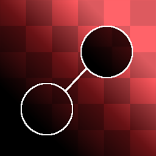

# Clone Patch

<table>
<tr style="border: 0;">
<td style="border: 0;" valign="top">

{width="128px"}

{width="128px"}

## Clone Patch / Clone Patch Grayscale

**In:** *Material Filters/Scan Processing*

**Complex**

</td>
<td style="border: 0;" valign="top">

## Description

Clone Patch is a procedural, parametric "Clone Stamp" node. It clones one area of an input to another, hiding potentially unwanted details. While it's not as quick and easy as using a familiar tool in a brush-based application, it does provide the key advantage of being non-destructive and working within a node-based workflow. Additionally, this node performs a smart analysis of both target and source area, and tries to blend things as well as possible based on contrast, values and shapes.

This is mostly intended for those rare moments where you want to do a manual fix of a specific area, in case there is an unwanted detail somewhere.

Keep in mind this does not work like a standard, simple "Stamp" brush. The shape of your blended area is based on the shapes and values of the areas you're working with, meaning this is quite a heavy node that requires patience - but does offer excellent results.

Also important to understand is the fact that you can move the Target area with a gizmo, but the Source area needs to be set by changing the "Source Matrix" Parameters.

>[!NOTE]
>
> If you want this for a full material (as is most often the case), see [Material Clone Patch](../material-clone-patch/material-clone-patch.md).
> 
> For those cases where you want to perform this operation on multiple inputs at the same time (without it being a material), see [Multi Clone Patch](../multi-clone-patch/multi-clone-patch.md).

## Parameters

* **Is Normal (only for Color)**: *False/True*  
  Sets whether the input is a Normalmap, and whether blending should be treated as such.
* **Shape**: *Square, Disc*Sets Stamp shape. Used only as base.
* **Edge**   
  * **Threshold**: *0.0 - 1.0*Sets how far the blended area should reach. This grows in steps, along shapes in the target area, and has very little effect with uniform backgrounds*.*
  * **Blur**: *0.0 - 2.0*Blurs the edges of the stamp area in case a softer transition is needed.
  * **Smoothness**: *0.0 - 2.0*Rounds off the edges of the stamp shape, making for smoother-flowing outlines.
  * **Grid Resolution**: *1 - 11*Sets the quality resolution of the blending analysis. A higher value means more accurate blending.
* **Transformations**   
  * **Source Matrix**: *(Transformation Matrix)*Transforms source (Scale &amp; Rotation). Cannot be done on canvas, change through these parameters only.
  * **Source Offset**: *-0.5 - 0.5*Translates source location. Cannot be done on canvas, change through these parameters only. *This parameter is probably the main one you want to change!*
  * **Target Matrix**: *(Transformation Matrix)*Transforms target location (Scale &amp; Rotation). Can also be done through gizmo on canvas.
  * **Target Offset**: *-0.5 - 0.5*Translates target location. Can also be done through gizmo on canvas.

## Example Images

|  |
| --- |
| There are no images attached to this page. |

</td>
</tr>
</table>

 