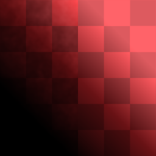

# Color Equalizer

<table>
<tr style="border: 0;">
<td width="33.33%" style="border: 0;" valign="top">

{width="128px"}

<b>In:</b> Material Filters &gt; Scan Processing

</td>
<td width="100.00%" style="border: 0;" valign="top">

## Description

This node works like a high-quality [Highpass](../../../../../../compositing-graphs/nodes-reference-for-com/node-library/filters/adjustments/highpass/highpass.md) for color differences. Where a normal Highpass removes saturation and can introduce unwanted sharpness, Color Equalizer works for evening out color differences and removing unwanted tints at a user-selectable scale.

This is very useful if a photo or scan has unwanted color differences, or a tint that you want removed. If you've used [Highpass](../../../../../../compositing-graphs/nodes-reference-for-com/node-library/filters/adjustments/highpass/highpass.md), this node should feel familiar.

The masking options are intended for removing very specific tints or for operating only in specific value ranges. Use these if you feel the effect is too broad.

</td>
</tr>
</table>

## Inputs

|  |  |
|:---|:---|
| <b>Input</b> <i>Color Input</i> |  |
| <b>Mask Input</b> <i>Grayscale Input</i> | Mask slot used for masking the node's effects. Only active when Mask is set to "Input". |

## Parameters

|  |  |
|:---|:---|
| <b>Input Tiled</b> <i>False/True</i> | Optionally preserves tiling on edges. |
| <b>Radius</b> <i>0.0 - 50.0</i> | Sets equalising radius. A larger radius will only remove large color differences. This requires tweaking for every image. |
| <b>Bright/Dark Balance</b> <i>0.0 - 1.0</i> | Bias setting to leave or remove darker tints. |
| <b>Custom Color Variation</b> <i>False/True</i> | Enables the ability to vary the effect towards a user-specified color. |
| <b>Color Variation</b> | Only active if Custom Color Variation is enabled. Settings allow you to select a tint offset to equalise towards. |
| <b>Hue</b> <i>0.0 - 360.0</i> |  |
| <b>Chroma</b> <i>0.0 - 1.0</i> |  |
| <b>Luma</b> <i>0.0 - 1.0</i> |  |
| <b>Mask Source</b> <i>None, Image Average, Color Parameter, Input</i> | Set if any kind of masking should happen. Color Parameter enables the below additional settings, Input switches to a user-defined mask input. |
| <b>Mask</b> | This is only active with Color Parameter masking. Additional masking parameters to determine the mask based on the image itself. The below parameters allow you to precisely convert a tint to a binary mask on which the Equalisation is applied. Note that the Radius parameter's effects can become much less pronounced when using these settings. |
| <b>Color</b> <i>(Color value)</i> |  |
| <b>Hue Range</b> <i>0.0 - 360.0</i> |  |
| <b>Chroma Range</b> <i>0.0 - 1.0</i> |  |
| <b>Luma Range</b> <i>0.0 - 1.0</i> |  |
| <b>Blur</b> <i>0.0 - 2.0</i> |  |
| <b>Smoothness</b> <i>0.0 - 2.0</i> |  |
