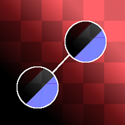

# Material Clone Patch

<table>
<tr style="border: 0;">
<td style="border: 0;" valign="top">

{width="128px"}

## Material Clone Patch

**In:** *Material Filters/Scan Processing*

**Complex**

</td>
<td style="border: 0;" valign="top">

## Description

This is the Multi-Channel, full material version of [Clone Patch](../../../../../../compositing-graphs/nodes-reference-for-com/node-library/material-filters/scan-processing/clone-patch/clone-patch.md). It performs a Clone Patch on any and all channels of a material. [See the original version for more information!](../../../../../../compositing-graphs/nodes-reference-for-com/node-library/material-filters/scan-processing/clone-patch/clone-patch.md)

This is very useful if you want to remove a detail from all channels of a material. Outputs debug images for multiple channels to see what the smart patch area looks like exactly.

## Parameters

### Inputs

* **Mask**: *Grayscale Input*   
  Mask slot used for masking the node's effects. Can be toggled with the "Mask" parameter.

### Parameters

* **Channels**  
  * Toggle material channels on and off in this group, for example when using Specular/Glossiness maps instead of Metallic/Roughness.
* **Shape**: *Square, Disc*Sets Stamp shape. Used only as base.
* **Edge**  
  * **Threshold (for multiple channels)**: *0.0 - 1.0*Sets how far the blended area should reach. This grows in steps, along shapes in the target area, so it has very little effect with uniform backgrounds*.*Be careful with changing this too much between channels, as it could lead to visual discrepancies!
  * **Blur**: *0.0 - 2.0*Blurs the edges of the stamp area in case a softer transition is needed.
  * **Smoothness**: *0.0 - 2.0*Rounds off the edges of the stamp shape, making for smoother-flowing outlines.
  * **Grid Resolution**: *1 - 11*Sets the quality resolution of the blending analysis. A higher value means more accurate blending.
* **Transformations**  
  * **Source Matrix**: *(Transformation Matrix)*Transforms source (Scale &amp; Rotation). Cannot be done on canvas, change through these parameters only.
  * **Source Offset**: *-0.5 - 0.5*Translates source location. Cannot be done on canvas, change through these parameters only. *This parameter is probably the main one you want to change!*
  * **Target Matrix**: *(Transformation Matrix)*Transforms target location (Scale &amp; Rotation). Can also be done through gizmo on canvas.
  * **Target Offset**: *-0.5 - 0.5*Translates target location. Can also be done through gizmo on canvas.

## Example Images

|  |
| --- |
| There are no images attached to this page. |

</td>
</tr>
</table>
