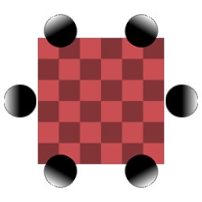

# Multi-Angle to Albedo

<table>
<tr style="border: 0;">
<td width="33.33%" style="border: 0;" valign="top">

{width="128px"}

<b>In:</b> Material Filters &gt; Scan Processing

</td>
<td width="100.00%" style="border: 0;" valign="top">

## Description

This node attempts to remove all-lighting information from a set of input photographs/scans that were taken under different lighting angles. It combines all samples into one single image that should be as lighting-neutral, and thus PBR-correct, as possible.

Keep in mind that the more samples you have and the bigger the difference in lighting angle is, the greater the success you will achieve. From four samples onwards, it should be possible to achieve near-perfect results, depending on your input images. Input images should be taken with a tripod and have minimal or ideally even no differences, except for lighting from a different angle!

>[!NOTE]
>
> See [Multi-Angle to Normal](../../../../../../compositing-graphs/nodes-reference-for-com/node-library/material-filters/scan-processing/multi-angle-to-normal/multi-angle-to-normal.md) for the Normalmap version of this node. If you want to pre-process your inputs, [Multi Color Equalizer](../../../../../../compositing-graphs/nodes-reference-for-com/node-library/material-filters/scan-processing/multi-color-equalizer/multi-color-equalizer.md), [Multi Crop](../../../../../../compositing-graphs/nodes-reference-for-com/node-library/material-filters/scan-processing/multi-crop/multi-crop.md) and [Multi Clone Patch](../../../../../../compositing-graphs/nodes-reference-for-com/node-library/material-filters/scan-processing/multi-clone-patch/multi-clone-patch.md) can be useful, as they are intended to be combined with these nodes.
> 
> [The blog post "Your Smartphone is a material scanner" illustrates this process a bit better.](https://www.allegorithmic.com/blog/your-smartphone-material-scanner)

</td>
</tr>
</table>

## Inputs

|  |  |
|:---|:---|
| <b>Input 1-8</b> <i>Color Input</i> | The number of inputs is determined by the Samples Amount parameter. |

## Parameters

|  |  |
|:---|:---|
| <b>Samples Amount</b> <i>2 - 8</i> | Sets the number of samples (inputs) to use in processing. |
