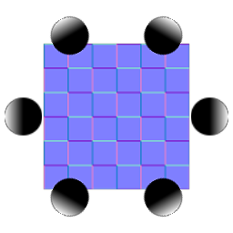

# Multi-Angle to Normal

<table>
<tr style="border: 0;">
<td style="border: 0;" valign="top">

{width="128px"}

## Multi-Angle to Normal

**In:** *Material Filters/Scan Processing*

**Intermediate**

</td>
<td style="border: 0;" valign="top">

## Description

This node constructs a Normalmap out of a set of photographs/scans made under different lighting conditions. It allows for a much more accurate Normalmap conversion than when trying to extract Normals from one single albedo image.

It is more complicated than [Multi-Angle to Albedo](../../../../../../compositing-graphs/nodes-reference-for-com/node-library/material-filters/scan-processing/multi-angle-to-albedo/multi-angle-to-albedo.md), as it requires you to use set, precise lighting angles for your inputs. Every sample's lighting angle should be spaced evenly and samples need to be input in sequence. So for three samples, lighting angles should be taken at: 0, 120, 240 - or any uniform offset of that (such as 90, 210, 330).

>[!NOTE]
>
> See [Multi-Angle to Albedo](../../../../../../compositing-graphs/nodes-reference-for-com/node-library/material-filters/scan-processing/multi-angle-to-albedo/multi-angle-to-albedo.md) for the albedo version of this node. If you want to pre-process your inputs, [Multi Color Equalizer](../../../../../../compositing-graphs/nodes-reference-for-com/node-library/material-filters/scan-processing/multi-color-equalizer/multi-color-equalizer.md), [Multi Crop](../../../../../../compositing-graphs/nodes-reference-for-com/node-library/material-filters/scan-processing/multi-crop/multi-crop.md) and [Multi Clone Patch](../../../../../../compositing-graphs/nodes-reference-for-com/node-library/material-filters/scan-processing/multi-clone-patch/multi-clone-patch.md) can be of use, since they are intended to be combined with these nodes.

## Parameters

### Inputs

* **Input 1-8**: *Color Input*

### Parameters

* **Normal Format**: *DirectX, OpenGL*  
  Switches between different Normalmap formats (inverts the green channel).
* **Samples Amount**: *2 - 8*Sets amount of samples (inputs) to process.
* **Intensity**: *0.0 - 1.0*Sets Normalmap intensity.
* **First Sample Light Angle**: *0.0 - 360.0*Sets the lighting angle direction of the first input.
* **Next Sample Light Angle**: *Counterclockwise, Clockwise*Sets towards which direction the lighting in the next sample moves.

## Example Images

|  |
| --- |
| There are no images attached to this page. |

</td>
</tr>
</table>
