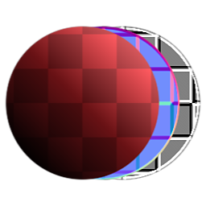

# Material Transform

<table>
<tr style="border: 0;">
<td style="border: 0;" valign="top">

{width="128px"}

## Material Transform

**In:** *Material Filters/Transforms*

**Simple**

</td>
<td style="border: 0;" valign="top">

## Description

Material Transform is simply the "Multi-Channel" Materials version of [the atomic Transformation 2D node](../../../../atomic-nodes/transformation-2d/transformation-2d.md). It transforms all channels of an input material at the same time, with the same interface as Transform 2D.

Just make sure to set up the Channels properly! By default, both Metallic/Roughness and Specular/Glossiness are enabled, which could lead to some confusion.

## Parameters

* **Transformation**: *(Transformation Matrix)*  
  Rotates and scales the result. Moving/panning is done via the Offset parameter
* **Offset**: *-0.5 - 0.5*  
  Moves or translates the result. When the Transformation control is present, the result can be modified by directly interacting with the canvas.
* **Normal Format**  
  Choose between DirectX and OpenGL formats (flip green).
* **Channels**  
  Toggle material channels on and off in this group, for example when using Specular/Glossiness maps instead of Metallic/Roughness.

## Example Images

|  |
| --- |
| There are no images attached to this page. |

</td>
</tr>
</table>

 