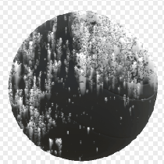

# Dripping Rust

<table>
<tr style="border: 0;">
<td width="33.33%" style="border: 0;" valign="top">

{width="128px"}

<b>In:</b> Mesh Based Generators &gt; Mask Generators

</td>
<td width="100.00%" style="border: 0;" valign="top">

## Description

Generates a black and white mask based on baked maps and user settings. Similar to [Smart Masks](https://support.allegorithmic.com/documentation/display/SPDOC/Smart+Materials+and+Masks) in [Painter](https://support.allegorithmic.com/documentation/display/SPDOC/Substance+Painter).

This mask represents rust flakes and specks, with leaks running down.

</td>
</tr>
</table>

## Inputs

|  |  |
|:---|:---|
| <b>Curvature</b> <i>Grayscale Input</i> | Baked or generated map to help with rust placement. |
| <b>Ambient Occlusion</b> <i>Grayscale Input</i> | Baked or generated map to help with rust placement. |
| <b>Position</b> <i>Grayscale Input</i> | Baked or generated map for drip directions. |
| <b>Mask (optional)</b> <i>Grayscale Input</i> | Mask slot used for masking the node's effects. |

## Parameters

|  |  |
|:---|:---|
| <b>Rust Spreading</b> <i>0.0 - 1.0</i> | Main control for the amount of rust. |
| <b>Rust Contrast</b> <i>0.0 - 1.0</i> | Sets the amount of contrast in generated rust specks (does not affect drips). |
| <b>Spreading Smoothness</b> <i>0.0 - 1.0</i> | Amount of blurring/smearing effect to apply to the rust specks. |
| <b>Drips Intensity</b> <i>0.0 - 1.0</i> | Sets strength and length of drips from flecks. |
| <b>Drips Smoothness</b> <i>0.0 - 1.0</i> | Amount of blurring and smoothing to apply to drips. |
| <b>Drips Samples Amount</b> <i>0 - 32</i> | Sets quality level (steps) for the drips effect. Has a slight effect on speed. |

## Examples

<table style="margin-top: 32px; margin-bottom: 32px">
    <tr style="border: 0">
        <td style="border: 0; background: transparent">
            
        </td>
    </tr>
</table>
