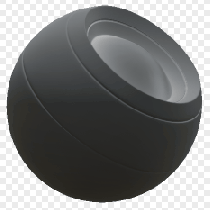

# Dust

<table>
<tr style="border: 0;">
<td style="border: 0;" valign="top">

{width="128px"}

## Dust

**In:** *Mesh Based Generators**/Mask Generators*

**Intermediate**

</td>
<td style="border: 0;" valign="top">

## Description

Generates a black and white mask based on baked maps and user settings. Similar to [Smart Masks](https://support.allegorithmic.com/documentation/display/SPDOC/Smart+Materials+and+Masks) in [Painter](https://support.allegorithmic.com/documentation/display/SPDOC/Substance+Painter).

This mask represents dust accumulated in occluded, lowered areas, as well as only in areas that face upwards. Requires proper baked AO and World Space Normals to work.

## Parameters

### Inputs

* **Ambient Occlusion**: *Grayscale Input*   
  Baked map used for dust placement. Required!
* **World Space Normal**: *Color Input*   
  Baked map used for dust placement. Required!
* **Noise**: *Grayscale Input*   
  Custom dust map (optional), only appears when Override Noise is set to True.
* **Mask (optional)**: *Grayscale Input*   
  Mask slot used for masking the node's effects.

### Parameters

* **Level**: *0.0 - 1.0*  
  Sets total amount of dust.
* **Contrast**: *0.0 - 1.0*  
  Adjusts contrast of the dust.
* **Occlusion Amount**: *0.0 - 1.0*Sets influence of AO; more dust will appear in occluded areas.
* **Noise Opacity**: *0.0 - 1.0*Sets amount of noise that is visible in the dusty areas.
* **Override Noise**: *False/True*Set to use custom dust map input.

## Example Images

</td>
</tr>
</table>
