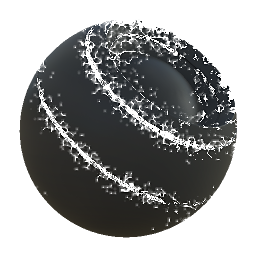

# Edge Dirt

<table>
<tr style="border: 0;">
<td width="33.33%" style="border: 0;" valign="top">

{width="128px"}

<b>In:</b> Mesh Based Generators &gt; Mask Generators

</td>
<td width="100.00%" style="border: 0;" valign="top">

## Description

Generates a black and white mask based on baked maps and user settings. Similar to [Smart Masks](https://support.allegorithmic.com/documentation/display/SPDOC/Smart+Materials+and+Masks) in [Painter](https://support.allegorithmic.com/documentation/display/SPDOC/Substance+Painter).

This mask represents a dirt effect that accumulates around edges, based solely on a curvature map.

</td>
</tr>
</table>

## Inputs

|  |  |
|:---|:---|
| <b>Curvature</b> <i>Grayscale Input</i> | Baked map used for effect placement. Required! |
| <b>Variation Mask</b> <i>Grayscale Input</i> | Mask slot used for masking the node's effects, only used when override parameter is enabled. |
| <b>Mask (optional)</b> <i>Grayscale Input</i> | Mask slot used for masking the node's effects. |

## Parameters

|  |  |
|:---|:---|
| <b>Level</b> <i>0.0 - 1.0</i> | Sets the amount of dirt. |
| <b>Contrast</b> <i>0.0 - 1.0</i> | Adjusts the contrast of the result. |
| <b>Variation</b> <i>0.0 - 1.0</i> | Blends in how much large-scale masking/breakup should happen. |
| <b>Override variation mask</b> <i>False/True</i> |  |

## Examples

<table style="margin-top: 32px; margin-bottom: 32px">
    <tr style="border: 0">
        <td style="border: 0; background: transparent">
            
        </td>
    </tr>
</table>
