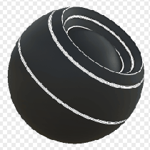

# Edge Select

<table>
<tr style="border: 0;">
<td style="border: 0;" valign="top">

{width="128px"}

## Edge Select

**In:** *Mesh Based Generators**/Mask Generators*

**Intermediate**

</td>
<td style="border: 0;" valign="top">

## Description

Generates a black and white mask based on baked maps and user settings. Similar to [Smart Masks](https://support.allegorithmic.com/documentation/display/SPDOC/Smart+Materials+and+Masks) in [Painter](https://support.allegorithmic.com/documentation/display/SPDOC/Substance+Painter).

This mask is the best way to select any kind of edge based on the curvature. Convex, Concave at any level or contrast can be isolated, providing an excellent shortcut to avoid manually doing this through a [Levels node](../../../../atomic-nodes/levels/levels.md).

## Parameters

### Inputs

* **Curvature**: *Grayscale Input*   
  Baked map used for highlighting edges. Required!
* **Mask (optional)**: *Grayscale Input*   
  Mask slot used for masking the node's effects.

### Parameters

* **Level**: *0.0 - 1.0*  
  Sets the total amount of edge highlighting for both Convex and Concave.
* **Contrast**: *0.0 - 1.0*  
  Adjusts the contrast of the highlighting for both Convex and Concave.
* **Convex**   
  * **Convex Edges Width**: *0.0 - 1.0*Sets width of the highlighting for Convex edges. Keep in mind that increasing Softness slightly can lead to thinner edges.
  * **Convex Softness**: *0.0 - 1.0*Set softness of the transition for Convex edges.
  * **Convex Intensity**: *0.0 - 1.0*Sets the maximum intensity of the Edge highlighting for Convex edges. Set to 0 for no highlighting.
* **Concave**   
  * **Concave Edges Width**: *0.0 - 1.0*Set width of the highlighting for Concave edges. Keep in mind that increasing Softness slightly can lead to thinner edges.
  * **Concave Softness**: *0.0 - 1.0*Set softness of the transition for Concave edges.
  * **Concave Intensity**: *0.0 - 1.0*Set the maximum intensity of the Edge highlighting for Concave edges. Set to 0 for no highlighting.

## Example Images

</td>
</tr>
</table>

 