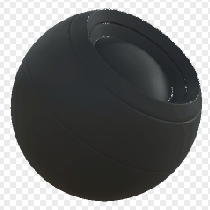

# Edge Speckle

<table>
<tr style="border: 0;">
<td style="border: 0;" valign="top">

{width="128px"}

## Edge Speckle

**In:** *Mesh Based Generators**/Mask Generators*

**Intermediate**

</td>
<td style="border: 0;" valign="top">

## Description

Generates a black and white mask based on baked maps and user settings. Similar to [Smart Masks](https://support.allegorithmic.com/documentation/display/SPDOC/Smart+Materials+and+Masks) in [Painter](https://support.allegorithmic.com/documentation/display/SPDOC/Substance+Painter).

This mask represents edges with a slight speckle added to break them up. Also see [Edge Dirt](../../../../../../compositing-graphs/nodes-reference-for-com/node-library/mesh-based-generators/mask-generators/edge-dirt/edge-dirt.md).

## Parameters

### Inputs

* **Curvature**: *Grayscale Input*   
  Baked map used for Edge highlighting. Required!
* **Variation Mask**: *Grayscale Input*   
  Optional mask slot used for masking the node's effects. Enable with "override variation mask".
* **Mask (optional)**: *Grayscale Input*   
  Mask slot used for masking the node's effects.

### Parameters

* **Level**: *0.0 - 1.0*  
  Sets the total amount of edge highlighting.
* **Contrast**: *0.0 - 1.0*  
  Adjusts the contrast of the result.
* **Edge selection**: *0.0 - 1.0*Sets the influence of convex edges.
* **Variation**: *0.0 - 1.0*Sets extent to which the variation mask breaks up the effect.
* **Override variation mask**: *False/True*Overrides built-in mask with custom input slot.

## Example Images

</td>
</tr>
</table>
