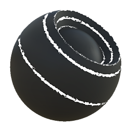

# Edge Wear

<table>
<tr style="border: 0;">
<td width="33.33%" style="border: 0;" valign="top">

{width="128px"}

<b>In:</b> Mesh Based Generators &gt; Mask Generators

</td>
<td width="100.00%" style="border: 0;" valign="top">

## Description

Generates a black and white mask based on baked maps and user settings. Similar to [Smart Masks](https://support.allegorithmic.com/documentation/display/SPDOC/Smart+Materials+and+Masks) in [Painter](https://support.allegorithmic.com/documentation/display/SPDOC/Substance+Painter).

This node represents wear on object edges. It has quite a few parameters, but is not the easiest to use: we recommend that you play around and get a feel for things. The node is quite powerful, although no custom override mask can be done.

</td>
</tr>
</table>

## Inputs

|  |  |
|:---|:---|
| <b>Curvature</b> <i>Grayscale Input</i> | Baked map used for internal effects and masking |
| <b>Mask (optional)</b> <i>Grayscale Input</i> | Mask slot used for masking the node's effects. |

## Parameters

|  |  |
|:---|:---|
| <b>Level</b> <i>0.0 - 1.0</i> | Sets total spread of the effect. |
| <b>Contrast</b> <i>0.0 - 1.0</i> | Adjusts the contrast of the result. |
| <b>Threshold</b> <i>0.0 - 1.0</i> | Similar to Level, sets total spread of the effect. |
| <b>Edges Width</b> <i>0.0 - 1.0</i> | Sets the fullness of the highlighting effect. Reduce to make them sparser. |
| <b>Disorder</b> <i>0.0 - 1.0</i> | Sets the amount of noise to blend in to break up the smoothness. |

## Examples

<table style="margin-top: 32px; margin-bottom: 32px">
    <tr style="border: 0">
        <td style="border: 0; background: transparent">
            
        </td>
    </tr>
</table>
