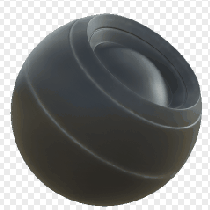

# Selective Dirt

<table>
<tr style="border: 0;">
<td style="border: 0;" valign="top">

{width="128px"}

## Selective Dirt

**In:** *Mesh Based Generators**/Mask Generators*

**Simple**

</td>
<td style="border: 0;" valign="top">

## Description

Generates a black and white mask based on baked maps and user settings. Similar to [Smart Masks](https://support.allegorithmic.com/documentation/display/SPDOC/Smart+Materials+and+Masks) in [Painter](https://support.allegorithmic.com/documentation/display/SPDOC/Substance+Painter).

This [Substance 3D Designer](https://www.adobe.com/products/substance3d-designer.html) mask represents a simple dirt effect on Convex edges.

## Parameters

### Inputs

* **Curvature**: *Grayscale Input*   
  Baked map used for internal effects and masking.
* **Variation Mask**: *Grayscale Input*   
  Optional variation map, can be enabled through parameters.
* **Mask (optional)**: *Grayscale Input*   
  Mask slot used for masking the node's effects.

### Parameters

* **Level**: *0.0 - 1.0*  
  Sets the total level of the effect, gradually revealing.
* **Contrast**: *0.0 - 1.0*  
  Adjusts the contrast of the result.
* **Variation**: *0.0 - 1.0*Sets amount of variation/grunge to blend into the effect.
* **Override variation mask**: *False/True*Enables overriding the variation with a custom input slot.

## Example Images

</td>
</tr>
</table>
