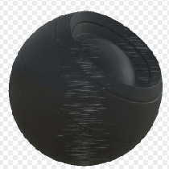

# Surface Brush

<table>
<tr style="border: 0;">
<td style="border: 0;" valign="top">

{width="128px"}

## Surface Brush

**In:** *Mesh Based Generators**/Mask Generators*

**Intermediate**

</td>
<td style="border: 0;" valign="top">

## Description

Generates a black and white mask based on baked maps and user settings. Similar to [Smart Masks](https://support.allegorithmic.com/documentation/display/SPDOC/Smart+Materials+and+Masks) in [Painter](https://support.allegorithmic.com/documentation/display/SPDOC/Substance+Painter).

This mask represents an interesting effect of metal-brushing on an object surface, occluded by object geometry and AO.

## Parameters

### Inputs

* **World Space Normal**: *Color Input*
* **Curvature**: *Grayscale Input*   
  Baked map used for internal effects and masking.
* **Ambient Occlusion**: *Grayscale Input*   
  Baked map used for internal effects and masking.
* **Position**: *Grayscale Input*
* **Mask (optional)**: *Grayscale Input*   
  Mask slot used for masking the node's effects.

### Parameters

* **Level**: *0.0 - 1.0*  
  Sets global effect level, gradually revealing.
* **Contrast**: *0.0 - 1.0*  
  Adjusts the contrast of the result.
* **Scratches Lenght**: *0.0 - 8.0*Sets the length of scratches. Smaller values are more like dots, higher values are long streaks.
* **Occlude Axis**: *X, Y, Z, none*Axis of the object that should receive scratches. Does not alter direction of the scratches.
* **Occlude Axis Intensity**: *0.0 - 1.0*Strength of the axis occlusion effect.
* **Occlusion**: *0.0 - 1.0*Strength of the AO on occluding scratches.
* **Sharpen Intensity**: *0.0 - 1.0*Set amount of post-sharpening to apply to the scratches.

## Example Images

</td>
</tr>
</table>
