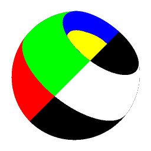
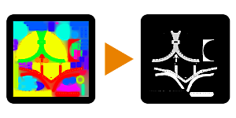

# Material Selector

<table>
<tr style="border: 0;">
<td width="33.33%" style="border: 0;" valign="top">

{width="128px"}

<b>In:</b> Mesh Based Generators &gt; Utilities

</td>
<td width="100.00%" style="border: 0;" valign="top">

## Description

Converts a full-color ID map to a binary, black and white mask. Allows blending and combining of different colors into one mask.

This is handy if you don't want to use [Multi-Material Blend](../../../../../../compositing-graphs/nodes-reference-for-com/node-library/material-filters/blending-material/multi-material-blend/multi-material-blend.md) and prefer to use the mask manually, or alternatively if you want to manually use those same masks in other locations.

</td>
</tr>
</table>

## Parameters

|  |  |
|:---|:---|
| <b>Materials</b> <i>1 - 16</i> | Sets number of materials that combining is enabled for. |
| <b>Enable Material #1-16</b> <i>False/True</i> | Toggles blending and combining of colors into the final output mask. Can be enabled for as many colors as you want to combine. |
| <b>Material #1-16</b> <i>(Color value)</i> | Colorpicker for the materials color that will be converted to black and white. |
| <b>Color Picker Parameters</b> | Modifies blending and conversion of the color to black and white. |
| <b>Fuzziness</b> <i>0.01 - 1.0</i> | How much to blend in with neighbouring colors. |
| <b>Padding</b> <i>0.0 - 1.0</i> | Sharpness of the transition, like Contrast. |

## Examples

<table style="margin-top: 32px; margin-bottom: 32px">
    <tr style="border: 0">
        <td style="border: 0; background: transparent">
            
        </td>
    </tr>
</table>
