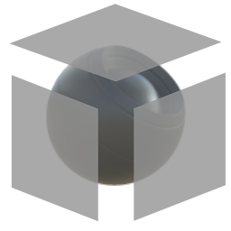

# Tri Planar

<table>
<tr style="border: 0;">
<td width="33.33%" style="border: 0;" valign="top">

{width="128px"}

{width="128px"}

<b>In:</b> Mesh Based Generators &gt; Utilities

</td>
<td width="100.00%" style="border: 0;" valign="top">

## Description

This advanced node performs Triplanar projection mapping in 2D, based on baked Position an World Space Normal data. This means it essentially completely converts UV-coordinates into a (mostly) seam-free mapping based on the mesh itself.

This is a good way to avoid seams without having to rebake every time (it is possible to achieve something similar with the baker). The downside is that this node is quite heavy and thus not fast.

Do keep in mind that your bakes should be high-precision: 8-bit bakes will not lead to very nice results.

</td>
</tr>
</table>

## Inputs

|  |  |
|:---|:---|
| <b>Position</b> <i>Color Input</i> | Baked Position map. Ideally 16-bit or higher precision. |
| <b>World Space Normal</b> <i>Color Input</i> | Baked World Space Normal map, Ideally 16-bit or higher precision. |
| <b>Input X</b> <i>Color Input (Grayscale Input)</i> | Input map to remap from UV to World Space via Triplanar projection. Used for all Axes when Image Inputs is set to 1, for X axis if set to 3. |
| <b>Input Y</b> <i>Color Input (Grayscale Input)</i> | Only if Image Inputs is set to 3. Input map to remap from UV to World Space on the Y Axis. |
| <b>Input Z</b> <i>Color Input (Grayscale Input)</i> | Only if Image Inputs is set to 3. Input map to remap from UV to World Space on the Z Axis. |

## Parameters

|  |  |
|:---|:---|
| <b>Projection</b> <i>All axis, X only, Y only, Z only</i> | Sets which Axes to blend with. |
| <b>Image Inputs</b> <i>1 input, 3 inputs</i> | Set whether to use one Map for all Axes, or a specific map per Axis. |
| <b>Blending Mode</b> <i>linear, advanced</i> | Increases accuracy and precision. |
| <b>Blending Contrast</b> <i>0.001 - 1.0</i> | Transition contrast, blend between smooth or harsh transitions. |
| <b>Normalization Factor</b> <i>0.0 - 1.0</i> | Improves the projection blending by restoring the loss of contrast in the blending area. |
| <b>Texture Tiling</b> <i>0.0 - 10.0</i> | Number of times to tile the input textures. |
| <b>Global Rotation</b> <i>0.0 - 1.0</i> | Global Rotation for all Axes. |
| <b>Fix Mirrored Projection</b> <i>False/True</i> | Set how to handle Mirrored Projections. |
| <b>Rotation X</b> <i>0.0 - 1.0</i> | Individual rotation over projection X-axis. |
| <b>Rotation Y</b> <i>0.0 - 1.0</i> | Individual rotation over projection Y-axis. |
| <b>Rotation Z</b> <i>0.0 - 1.0</i> | Individual rotation over projection Z-axis. |
| <b>Offset X</b> <i>0.0 - 1.0</i> | Offset over projection X-axis. |
| <b>Random Offset X</b> <i>0.0 - 1.0</i> | Allow for randomisation of X-axis offset. |
| <b>Offset Y</b> <i>0.0 - 1.0</i> | Offset over projection Y-axis. |
| <b>Random Offset Y</b> <i>0.0 - 1.0</i> | Allow for randomisation of Y-axis offset. |
| <b>Offset Z</b> <i>0.0 - 1.0</i> | Offset over projection Z-axis. |
| <b>Random Offset Z</b> <i>0.0 - 1.0</i> | Allow for randomisation of Z-axis offset. |
