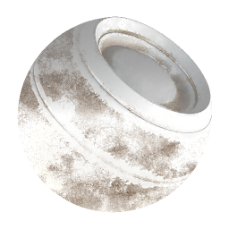

# Fabric Weathering

<table>
<tr style="border: 0;">
<td style="border: 0;" valign="top">

{width="128px"}

## Fabric Weathering

**In:** *Mesh Based Generators**/Weathering*

**Complex**

</td>
<td style="border: 0;" valign="top">

## Description

This is a full-material effect that works on multiple channels at once. It adds a random fabric wear effect, with control for age and dirtiness.  
This effect does not work very well unless you have proper baked AO and World Space Normalmaps plugged in, since it requires these to adequately calculate and generate everything.

Make sure to fully understand the [Link Creation Modes](../../../../../../help/interface/the-graph-view/link-creation-modes/link-creation-modes.md) when working with full materials.

## Parameters

### Inputs

* **Ambient Occlusion**: *Grayscale Input*   
  Baked map used for internal effects and masking.
* **Normal Wold Space**: *Color Input*
* **Mask** : *Grayscale Input*   
  Mask slot used for masking the node's effects. Can be toggled with the "Mask" parameter.

### Parameters

* **Channels**   
  * Toggle material channels on and off in this group, for example when using Specular/Glossiness maps instead of Metallic/Roughness.
* **Advanced**   
  * **Normal Format**: *DirectX, OpenGL*  
    Switches between different Normalmap formats (inverts the green channel).
  * **Mask**: *False/True*  
    Toggles the use of the Mask map on or off.
* **Effect**   
  * **Dust**: *0.0 - 1.0*Blends in a darker dust effect, based on areas facing up in the World Space Normalmap.
  * **Dirtiness**: *0.0 - 1.0*Blends in a global dirt/smudge effect, based mostly on areas occluded (dark) in the AO.
  * **Edges Wearing**: *0.0 - 1.0*Adds a sharpening/intensifying effect to edges, based on Material Normal.
  * **Used**: *0.0 - 1.0*Blends in very dark accumulated dirt in creases, based on AO. Maximum and Minimum values tend to be very extreme, use these with care.
  * **Age**: *0.0 - 1.0*Blends over a global tiling wear pattern. Treshold control below controls AO influence. Maximum and Minimum values tend to be very extreme.
  * **Age Threshlod**: *0.0 - 1.0*Sets the extent to which the AO affects the Age parameter.
  * **Age Creases**: *0.0 - 1.0*Controls the blending of subtle additional creases in the Age effect.
  * **Sharp Edges Scratches Scale**: *1.0 - 32.0*Sets the scale of small scratches, which mainly scrape away Used and Age effect.
  * **Sharp Edges Scratches Warp Intensity**: *0.0 - 1.0*Sets the intensity of the warp for the above small scratches.
  * **Old Fabric Desaturation**: *0.0 - 1.0*Controls the desaturation of the Age effect.
  * **Old Fabric Brightness**: *0.0 - 1.0*Controls the brightness of the Age effect. *This is a very important parameter to change to get the look you like, but results can be extreme: use with subte changes.*
* **Blending**   
  * **Diffuse Intensity**: *0.0 - 1.0*  
    Blending strength of the Diffuse.
  * **Base Color Intensity**: *0.0 - 1.0*  
    Blending strength of the Base Color.
  * **Normal Intensity**: *0.0 - 1.0*  
    Blending strength of the Normal.
  * **Specular Intensity**: *0.0 - 1.0*  
    Blending strength of the Specular.
  * **Glossiness Intensity**: *0.0 - 1.0*  
    Blending strength of the Glossiness.
  * **Roughness Intensity**: *0.0 - 1.0*  
    Blending strength of the Roughness.
  * **Ambient Occlusion Intensity**: *0.0 - 1.0*  
    Blending strength of the Ambient Occlusion.
  * **Height Intensity**: *0.0 - 1.0*  
    Blending strength of the Height.

## Example Images

</td>
</tr>
</table>
